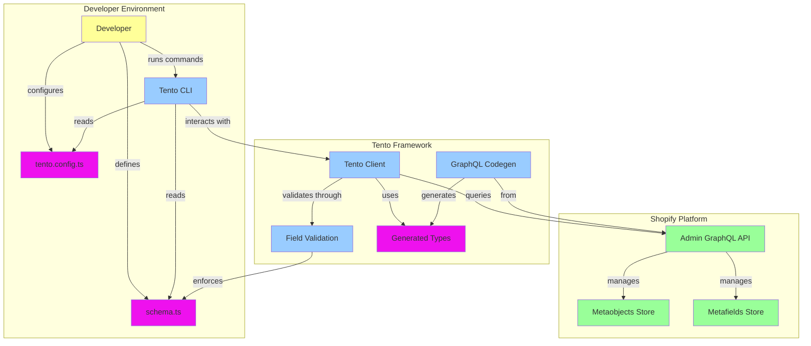
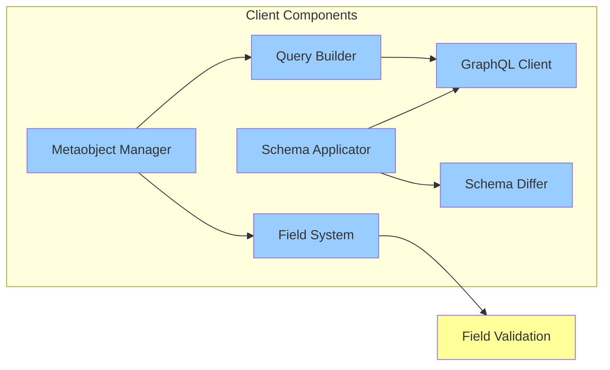
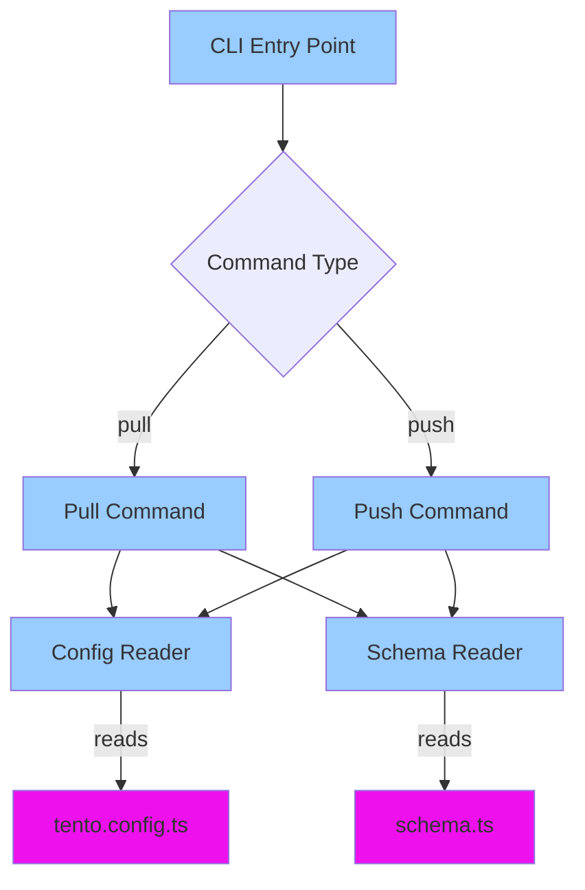
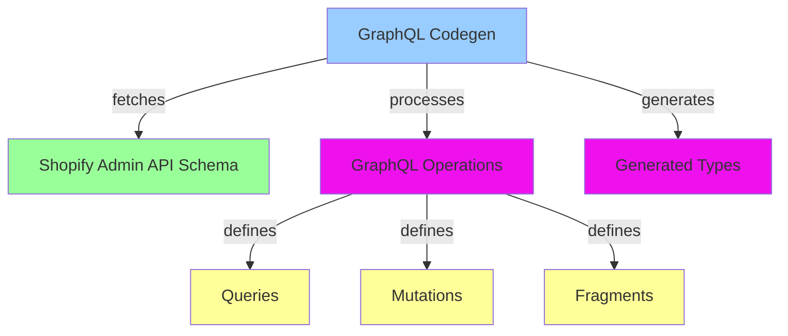
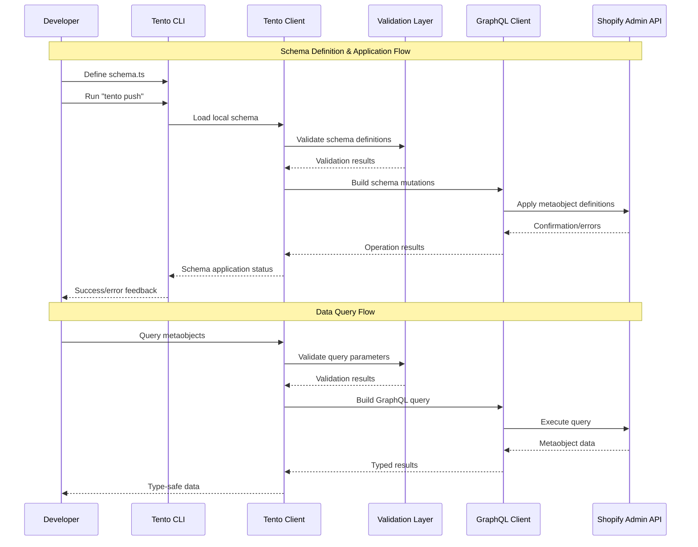

# Architecture Overview

This document provides a high-level overview of the Tento Shopify data framework architecture.

## System Overview

Tento is a TypeScript framework that provides type-safe interactions with Shopify's metaobject system through a client library and CLI tool.

## Core Components

### 1. Client Library (`src/client/`)

The type-safe client for interacting with Shopify metaobjects:

### 2. CLI Tool (`src/cli/`)

Command-line interface for schema management:

### 3. GraphQL Layer (`src/graphql/`)

Auto-generated GraphQL types and operations:

## Data Flow Architecture

## Technology Stack

### Runtime Environment
- **Node.js** - Runtime environment
- **TypeScript** - Primary language with full type safety
- **PNPM** - Package management

### Core Dependencies
- **GraphQL** - Query language for Shopify Admin API
- **Valibot** - Schema validation library
- **Shopify Admin API Client** - Official Shopify GraphQL client

### Development Tools
- **GraphQL Code Generator** - Automatic type generation
- **Biome** - Linting and formatting
- **TSup** - TypeScript bundling
- **esbuild** - Fast bundling for production

## Key Design Principles

### 1. Type Safety First
- Full TypeScript coverage with strict typing
- Generated types from Shopify GraphQL schema
- Runtime validation matching compile-time types

### 2. Developer Experience
- Intuitive API design following familiar patterns
- Comprehensive error messages with actionable feedback
- CLI tool for common operations

### 3. Schema-Driven Development
- Local schema definitions as source of truth
- Bidirectional synchronization with Shopify
- Validation and diffing capabilities

### 4. Modular Architecture
- Clear separation of concerns between components
- Plugin-like extensibility for field types
- Configurable client adapters for different Shopify setups

## Security Considerations

### Authentication
- Support for OAuth 2.0 flows
- Admin API access token management
- Configurable authentication headers

### Data Validation
- Server-side validation enforcement
- Type-safe query construction preventing injection
- Field-level validation rules with custom constraints

### API Rate Limiting
- Built-in retry mechanisms
- Configurable request throttling
- Error handling for rate limit responses