# Authentication Flows Architecture

This document details the authentication and authorization architecture in Tento, covering OAuth flows, API key management, and security patterns.

## Authentication Overview

Tento supports multiple authentication methods for connecting to Shopify's Admin API, with built-in security features and flexible configuration options.

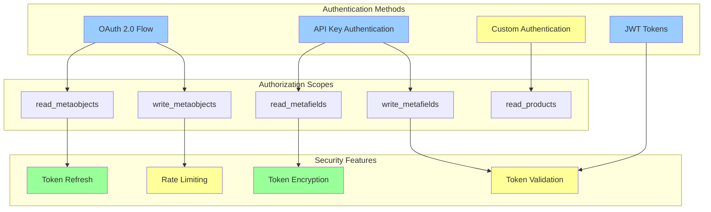
```mermaid
graph TB
    subgraph "Authentication Methods"
        OAuth[OAuth 2.0 Flow]
        APIKey[API Key Authentication]
        CustomAuth[Custom Authentication]
        JWT[JWT Tokens]
    end
    
    subgraph "Authorization Scopes"
        MetaObjectRead[read_metaobjects]
        MetaObjectWrite[write_metaobjects]
        MetaFieldRead[read_metafields]
        MetaFieldWrite[write_metafields]
        ProductRead[read_products]
    end
    
    subgraph "Security Features"
        TokenRefresh[Token Refresh]
        RateLimit[Rate Limiting]
        Encryption[Token Encryption]
        Validation[Token Validation]
    end
    
    OAuth --> MetaObjectRead
    OAuth --> MetaObjectWrite
    APIKey --> MetaFieldRead
    APIKey --> MetaFieldWrite
    CustomAuth --> ProductRead
    JWT --> Validation
    
    MetaObjectRead --> TokenRefresh
    MetaObjectWrite --> RateLimit
    MetaFieldRead --> Encryption
    MetaFieldWrite --> Validation
    
    style OAuth fill:#9cf
    style APIKey fill:#9cf
    style CustomAuth fill:#ff9
    style JWT fill:#9cf
    style TokenRefresh fill:#9f9
    style RateLimit fill:#ff9
    style Encryption fill:#9f9
    style Validation fill:#ff9
```

## OAuth 2.0 Implementation

### 1. OAuth Flow Architecture

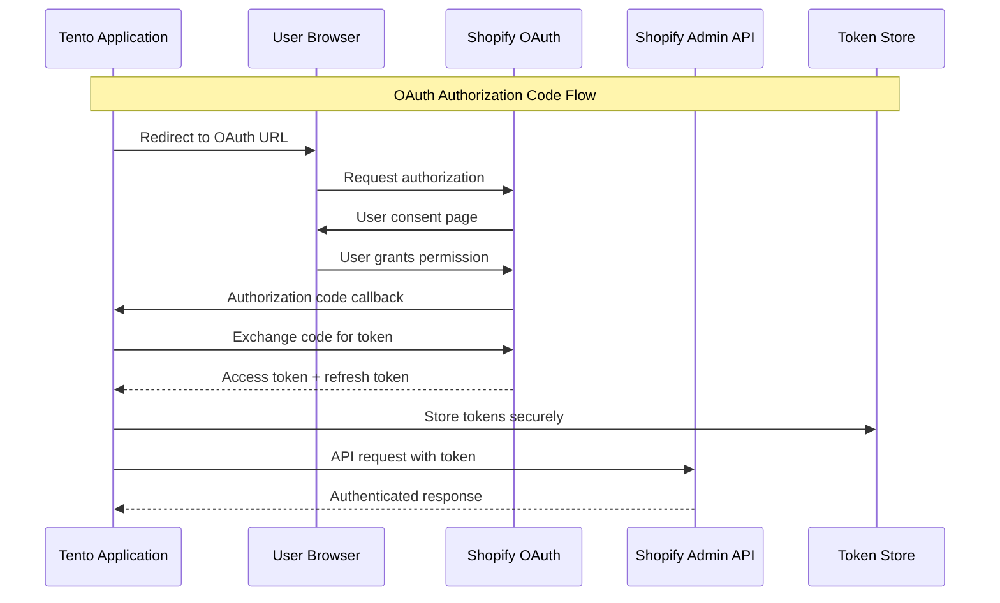
```mermaid
sequenceDiagram
    participant App as Tento Application
    participant Browser as User Browser
    participant Shopify as Shopify OAuth
    participant Admin as Shopify Admin API
    participant Store as Token Store

    Note over App, Store: OAuth Authorization Code Flow
    
    App->>Browser: Redirect to OAuth URL
    Browser->>Shopify: Request authorization
    Shopify->>Browser: User consent page
    Browser->>Shopify: User grants permission
    Shopify->>App: Authorization code callback
    App->>Shopify: Exchange code for token
    Shopify-->>App: Access token + refresh token
    App->>Store: Store tokens securely
    App->>Admin: API request with token
    Admin-->>App: Authenticated response
```

### 2. OAuth Configuration Management

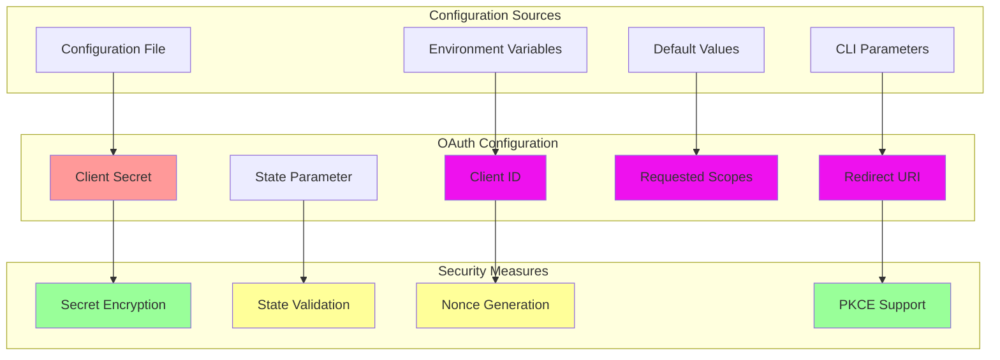
```mermaid
graph TB
    subgraph "OAuth Configuration"
        ClientID[Client ID]
        ClientSecret[Client Secret]
        RedirectURI[Redirect URI]
        Scopes[Requested Scopes]
        State[State Parameter]
    end
    
    subgraph "Configuration Sources"
        EnvVars[Environment Variables]
        ConfigFile[Configuration File]
        CLI[CLI Parameters]
        Defaults[Default Values]
    end
    
    subgraph "Security Measures"
        SecretEncryption[Secret Encryption]
        StateValidation[State Validation]
        NonceGeneration[Nonce Generation]
        PKCE[PKCE Support]
    end
    
    EnvVars --> ClientID
    ConfigFile --> ClientSecret
    CLI --> RedirectURI
    Defaults --> Scopes
    
    ClientSecret --> SecretEncryption
    State --> StateValidation
    ClientID --> NonceGeneration
    RedirectURI --> PKCE
    
    style ClientID fill:#e1e
    style ClientSecret fill:#f99
    style RedirectURI fill:#e1e
    style Scopes fill:#e1e
    style SecretEncryption fill:#9f9
    style StateValidation fill:#ff9
    style NonceGeneration fill:#ff9
    style PKCE fill:#9f9
```

### 3. Token Management System

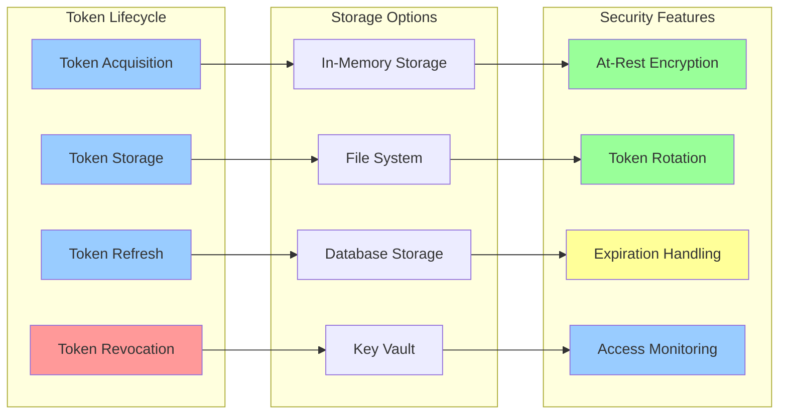
```mermaid
graph LR
    subgraph "Token Lifecycle"
        Acquisition[Token Acquisition]
        Storage[Token Storage]
        Refresh[Token Refresh]
        Revocation[Token Revocation]
    end
    
    subgraph "Storage Options"
        Memory[In-Memory Storage]
        FileSystem[File System]
        Database[Database Storage]
        KeyVault[Key Vault]
    end
    
    subgraph "Security Features"
        Encryption[At-Rest Encryption]
        Rotation[Token Rotation]
        Expiration[Expiration Handling]
        Monitoring[Access Monitoring]
    end
    
    Acquisition --> Memory
    Storage --> FileSystem
    Refresh --> Database
    Revocation --> KeyVault
    
    Memory --> Encryption
    FileSystem --> Rotation
    Database --> Expiration
    KeyVault --> Monitoring
    
    style Acquisition fill:#9cf
    style Storage fill:#9cf
    style Refresh fill:#9cf
    style Revocation fill:#f99
    style Encryption fill:#9f9
    style Rotation fill:#9f9
    style Expiration fill:#ff9
    style Monitoring fill:#9cf
```

## API Key Authentication

### 1. API Key Management

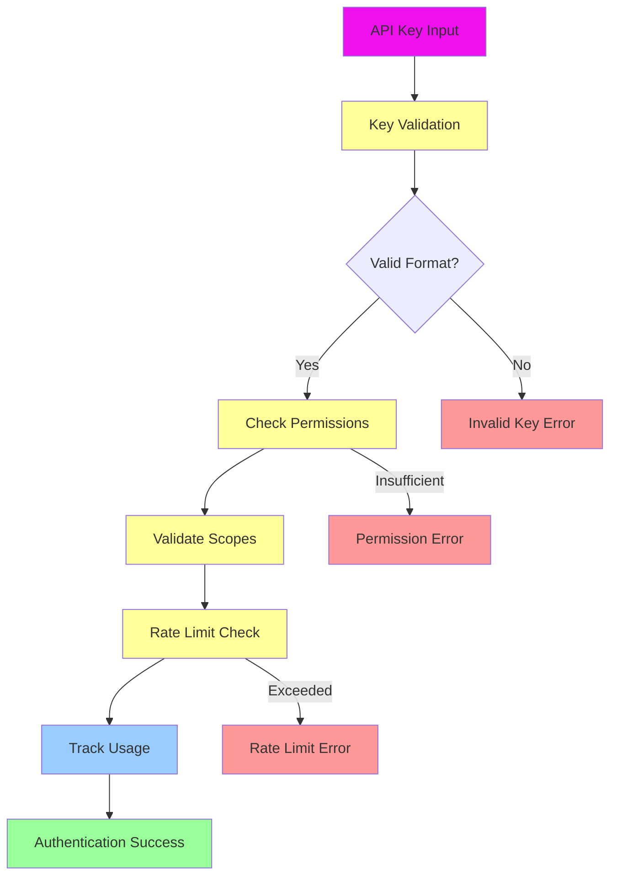
```mermaid
flowchart TD
    APIKey[API Key Input] --> Validation[Key Validation]
    Validation --> Format{Valid Format?}
    
    Format -->|Yes| Permissions[Check Permissions]
    Format -->|No| Error[Invalid Key Error]
    
    Permissions --> Scopes[Validate Scopes]
    Scopes --> RateCheck[Rate Limit Check]
    RateCheck --> Usage[Track Usage]
    Usage --> Success[Authentication Success]
    
    Permissions -->|Insufficient| PermError[Permission Error]
    RateCheck -->|Exceeded| RateError[Rate Limit Error]
    
    style APIKey fill:#e1e
    style Validation fill:#ff9
    style Permissions fill:#ff9
    style Scopes fill:#ff9
    style RateCheck fill:#ff9
    style Usage fill:#9cf
    style Success fill:#9f9
    style Error fill:#f99
    style PermError fill:#f99
    style RateError fill:#f99
```

### 2. Key Rotation Strategy

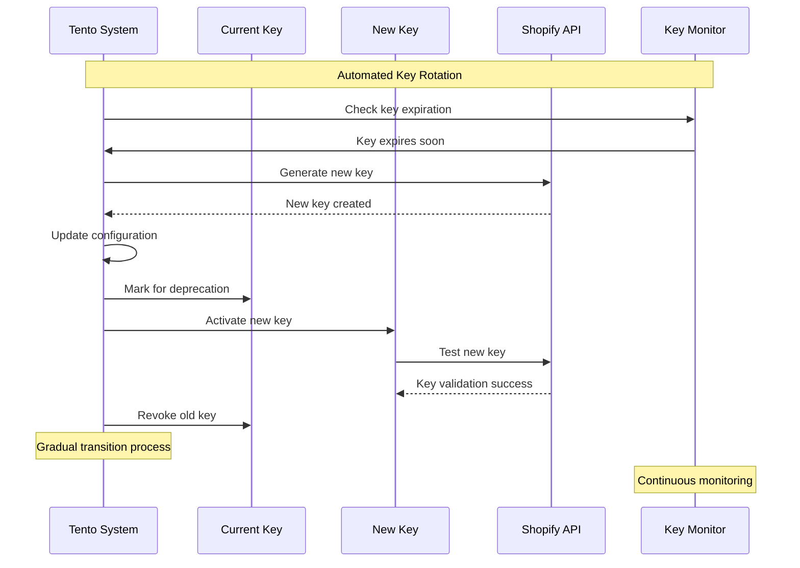
```mermaid
sequenceDiagram
    participant System as Tento System
    participant Current as Current Key
    participant New as New Key
    participant Shopify as Shopify API
    participant Monitor as Key Monitor

    Note over System, Monitor: Automated Key Rotation
    
    System->>Monitor: Check key expiration
    Monitor->>System: Key expires soon
    System->>Shopify: Generate new key
    Shopify-->>System: New key created
    System->>System: Update configuration
    System->>Current: Mark for deprecation
    System->>New: Activate new key
    New->>Shopify: Test new key
    Shopify-->>New: Key validation success
    System->>Current: Revoke old key
    
    Note over System: Gradual transition process
    Note over Monitor: Continuous monitoring
```

## Custom Authentication Adapters

### 1. Authentication Adapter Interface

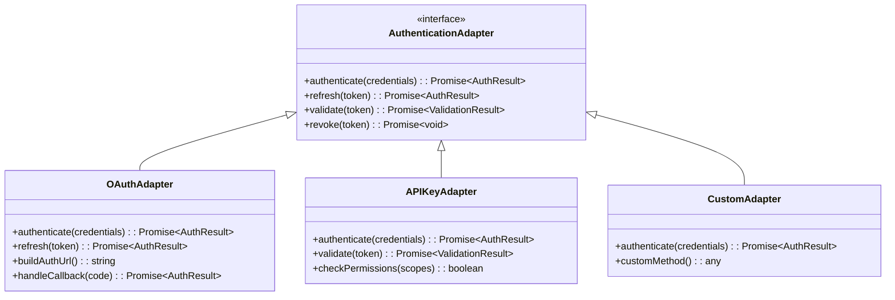
```mermaid
classDiagram
    class AuthenticationAdapter {
        <<interface>>
        +authenticate(credentials): Promise~AuthResult~
        +refresh(token): Promise~AuthResult~
        +validate(token): Promise~ValidationResult~
        +revoke(token): Promise~void~
    }
    
    class OAuthAdapter {
        +authenticate(credentials): Promise~AuthResult~
        +refresh(token): Promise~AuthResult~
        +buildAuthUrl(): string
        +handleCallback(code): Promise~AuthResult~
    }
    
    class APIKeyAdapter {
        +authenticate(credentials): Promise~AuthResult~
        +validate(token): Promise~ValidationResult~
        +checkPermissions(scopes): boolean
    }
    
    class CustomAdapter {
        +authenticate(credentials): Promise~AuthResult~
        +customMethod(): any
    }
    
    AuthenticationAdapter <|-- OAuthAdapter
    AuthenticationAdapter <|-- APIKeyAdapter
    AuthenticationAdapter <|-- CustomAdapter
```

### 2. Adapter Configuration

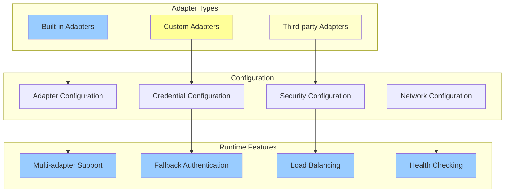
```mermaid
graph TB
    subgraph "Adapter Types"
        Built_in[Built-in Adapters]
        Custom[Custom Adapters]
        Third_Party[Third-party Adapters]
    end
    
    subgraph "Configuration"
        AdapterConfig[Adapter Configuration]
        CredentialConfig[Credential Configuration]
        SecurityConfig[Security Configuration]
        NetworkConfig[Network Configuration]
    end
    
    subgraph "Runtime Features"
        MultiAdapter[Multi-adapter Support]
        Fallback[Fallback Authentication]
        LoadBalancing[Load Balancing]
        HealthCheck[Health Checking]
    end
    
    Built_in --> AdapterConfig
    Custom --> CredentialConfig
    Third_Party --> SecurityConfig
    
    AdapterConfig --> MultiAdapter
    CredentialConfig --> Fallback
    SecurityConfig --> LoadBalancing
    NetworkConfig --> HealthCheck
    
    style Built_in fill:#9cf
    style Custom fill:#ff9
    style Third_Party fill:#ffc
    style MultiAdapter fill:#9cf
    style Fallback fill:#9cf
    style LoadBalancing fill:#9cf
    style HealthCheck fill:#9cf
```

## Security Architecture

### 1. Security Layers

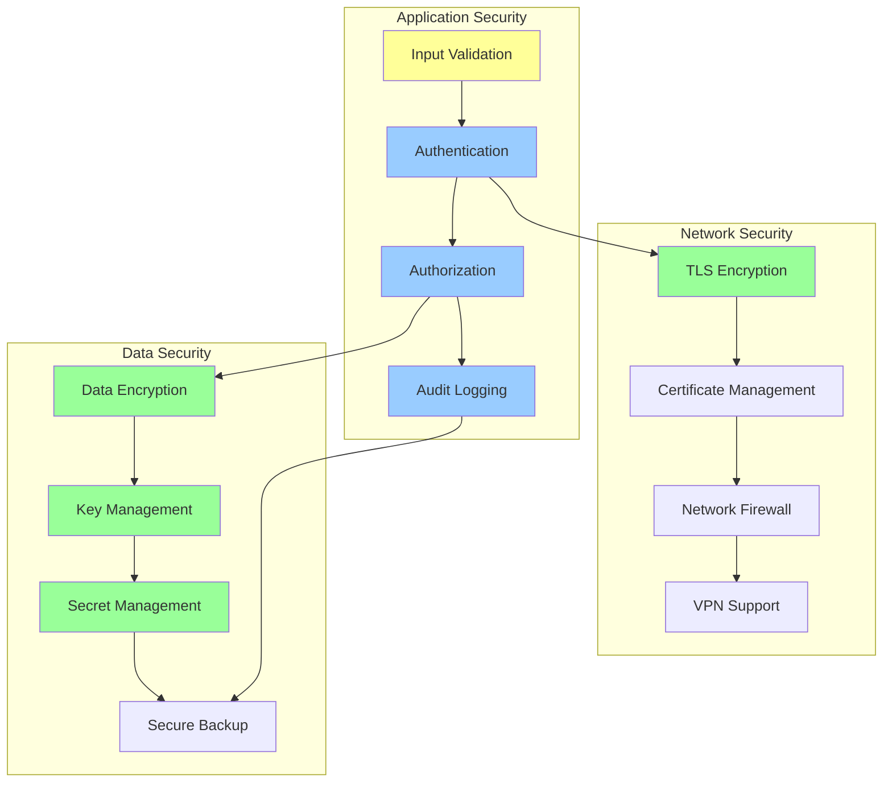
```mermaid
graph TB
    subgraph "Application Security"
        Input[Input Validation]
        Auth[Authentication]
        Authz[Authorization]
        Audit[Audit Logging]
    end
    
    subgraph "Network Security"
        TLS[TLS Encryption]
        Certificates[Certificate Management]
        Firewall[Network Firewall]
        VPN[VPN Support]
    end
    
    subgraph "Data Security"
        Encryption[Data Encryption]
        KeyMgmt[Key Management]
        Secrets[Secret Management]
        Backup[Secure Backup]
    end
    
    Input --> Auth
    Auth --> Authz
    Authz --> Audit
    
    TLS --> Certificates
    Certificates --> Firewall
    Firewall --> VPN
    
    Encryption --> KeyMgmt
    KeyMgmt --> Secrets
    Secrets --> Backup
    
    Auth --> TLS
    Authz --> Encryption
    Audit --> Backup
    
    style Input fill:#ff9
    style Auth fill:#9cf
    style Authz fill:#9cf
    style Audit fill:#9cf
    style TLS fill:#9f9
    style Encryption fill:#9f9
    style KeyMgmt fill:#9f9
    style Secrets fill:#9f9
```

### 2. Threat Mitigation

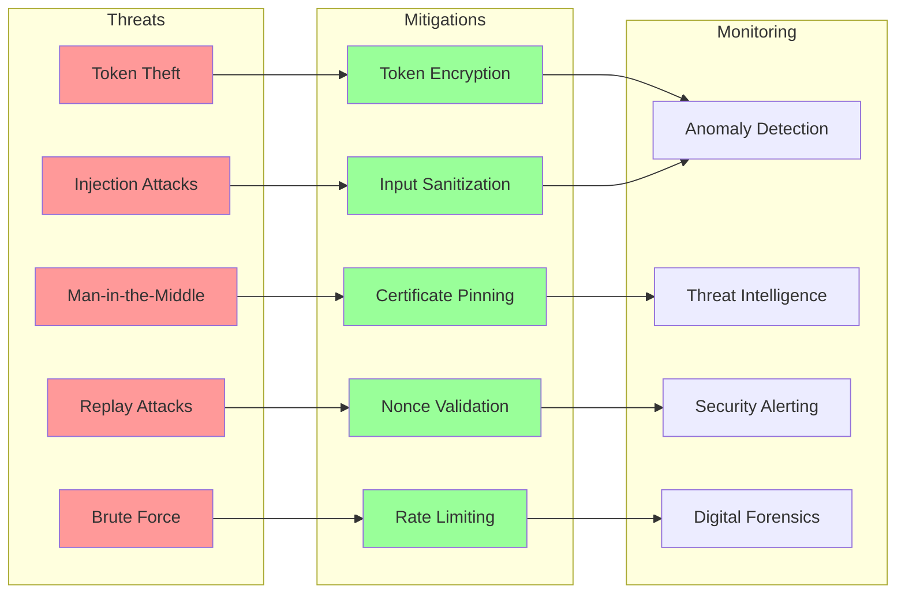
```mermaid
graph LR
    subgraph "Threats"
        TokenTheft[Token Theft]
        MITM[Man-in-the-Middle]
        ReplayAttack[Replay Attacks]
        Bruteforce[Brute Force]
        Injection[Injection Attacks]
    end
    
    subgraph "Mitigations"
        TokenEncryption[Token Encryption]
        CertPinning[Certificate Pinning]
        Nonces[Nonce Validation]
        RateLimit[Rate Limiting]
        Sanitization[Input Sanitization]
    end
    
    subgraph "Monitoring"
        AnomalyDetection[Anomaly Detection]
        ThreatIntel[Threat Intelligence]
        Alerting[Security Alerting]
        Forensics[Digital Forensics]
    end
    
    TokenTheft --> TokenEncryption
    MITM --> CertPinning
    ReplayAttack --> Nonces
    Bruteforce --> RateLimit
    Injection --> Sanitization
    
    TokenEncryption --> AnomalyDetection
    CertPinning --> ThreatIntel
    Nonces --> Alerting
    RateLimit --> Forensics
    Sanitization --> AnomalyDetection
    
    style TokenTheft fill:#f99
    style MITM fill:#f99
    style ReplayAttack fill:#f99
    style Bruteforce fill:#f99
    style Injection fill:#f99
    style TokenEncryption fill:#9f9
    style CertPinning fill:#9f9
    style Nonces fill:#9f9
    style RateLimit fill:#9f9
    style Sanitization fill:#9f9
```

## Permission System

### 1. Scope-based Authorization

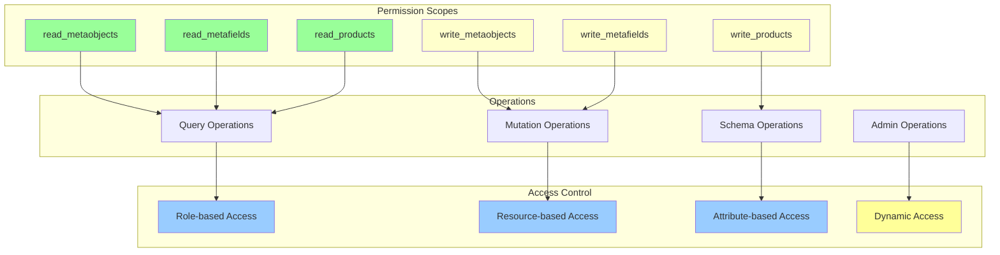
```mermaid
graph TB
    subgraph "Permission Scopes"
        ReadMeta[read_metaobjects]
        WriteMeta[write_metaobjects]
        ReadField[read_metafields]
        WriteField[write_metafields]
        ReadProduct[read_products]
        WriteProduct[write_products]
    end
    
    subgraph "Operations"
        QueryOps[Query Operations]
        MutationOps[Mutation Operations]
        SchemaOps[Schema Operations]
        AdminOps[Admin Operations]
    end
    
    subgraph "Access Control"
        RoleBase[Role-based Access]
        Resource[Resource-based Access]
        Attribute[Attribute-based Access]
        Dynamic[Dynamic Access]
    end
    
    ReadMeta --> QueryOps
    WriteMeta --> MutationOps
    ReadField --> QueryOps
    WriteField --> MutationOps
    ReadProduct --> QueryOps
    WriteProduct --> SchemaOps
    
    QueryOps --> RoleBase
    MutationOps --> Resource
    SchemaOps --> Attribute
    AdminOps --> Dynamic
    
    style ReadMeta fill:#9f9
    style WriteMeta fill:#ffc
    style ReadField fill:#9f9
    style WriteField fill:#ffc
    style ReadProduct fill:#9f9
    style WriteProduct fill:#ffc
    style RoleBase fill:#9cf
    style Resource fill:#9cf
    style Attribute fill:#9cf
    style Dynamic fill:#ff9
```

### 2. Permission Validation Flow

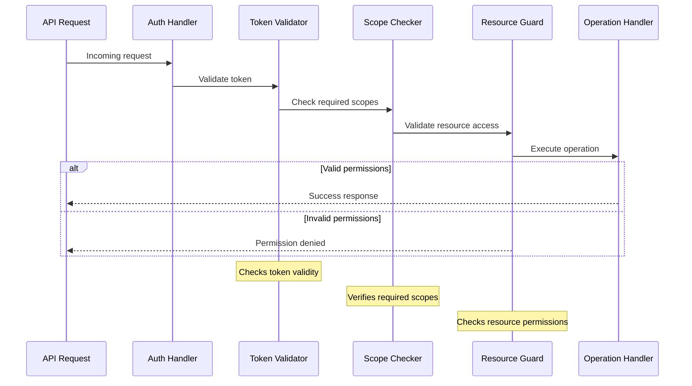
```mermaid
sequenceDiagram
    participant Request as API Request
    participant Auth as Auth Handler
    participant Token as Token Validator
    participant Scope as Scope Checker
    participant Resource as Resource Guard
    participant Operation as Operation Handler

    Request->>Auth: Incoming request
    Auth->>Token: Validate token
    Token->>Scope: Check required scopes
    Scope->>Resource: Validate resource access
    Resource->>Operation: Execute operation
    
    alt Valid permissions
        Operation-->>Request: Success response
    else Invalid permissions
        Resource-->>Request: Permission denied
    end
    
    Note over Token: Checks token validity
    Note over Scope: Verifies required scopes
    Note over Resource: Checks resource permissions
```

## Session Management

### 1. Session Architecture

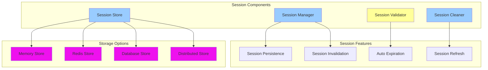
```mermaid
graph TB
    subgraph "Session Components"
        SessionStore[Session Store]
        SessionManager[Session Manager]
        SessionValidator[Session Validator]
        SessionCleaner[Session Cleaner]
    end
    
    subgraph "Storage Options"
        Memory[Memory Store]
        Redis[Redis Store]
        Database[Database Store]
        Distributed[Distributed Store]
    end
    
    subgraph "Session Features"
        Persistence[Session Persistence]
        Expiration[Auto Expiration]
        Refresh[Session Refresh]
        Invalidation[Session Invalidation]
    end
    
    SessionStore --> Memory
    SessionStore --> Redis
    SessionStore --> Database
    SessionStore --> Distributed
    
    SessionManager --> Persistence
    SessionValidator --> Expiration
    SessionCleaner --> Refresh
    SessionManager --> Invalidation
    
    style SessionStore fill:#9cf
    style SessionManager fill:#9cf
    style SessionValidator fill:#ff9
    style SessionCleaner fill:#9cf
    style Memory fill:#e1e
    style Redis fill:#e1e
    style Database fill:#e1e
    style Distributed fill:#e1e
```

### 2. Session Security

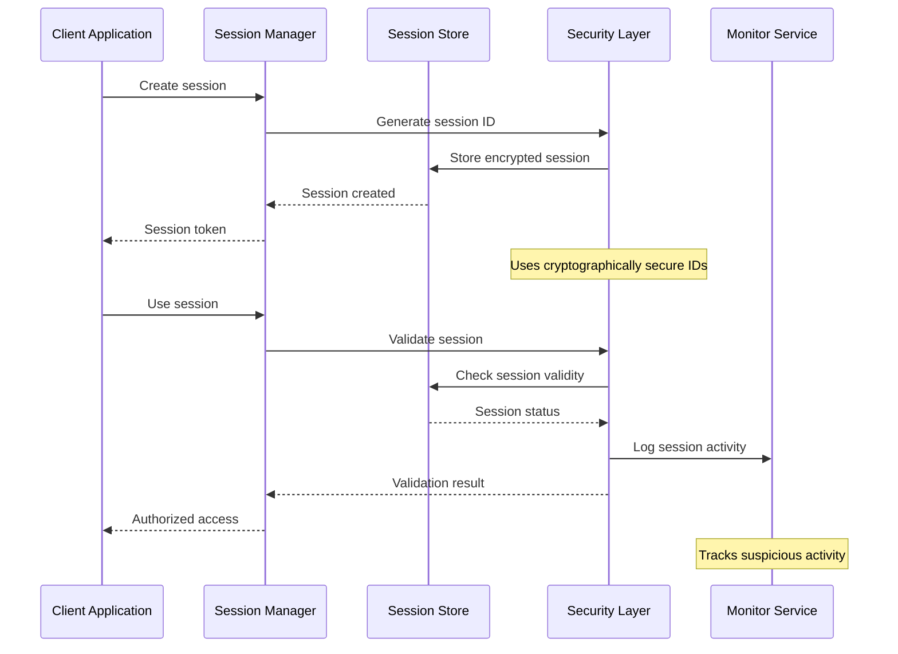
```mermaid
sequenceDiagram
    participant Client as Client Application
    participant Session as Session Manager
    participant Store as Session Store
    participant Security as Security Layer
    participant Monitor as Monitor Service

    Client->>Session: Create session
    Session->>Security: Generate session ID
    Security->>Store: Store encrypted session
    Store-->>Session: Session created
    Session-->>Client: Session token
    
    Note over Security: Uses cryptographically secure IDs
    
    Client->>Session: Use session
    Session->>Security: Validate session
    Security->>Store: Check session validity
    Store-->>Security: Session status
    Security->>Monitor: Log session activity
    Security-->>Session: Validation result
    Session-->>Client: Authorized access
    
    Note over Monitor: Tracks suspicious activity
```

## Error Handling in Authentication

### 1. Error Classification

```mermaid
graph TB
    AuthErrors[Authentication Errors] --> CredentialErrors[Credential Errors]
    AuthErrors --> TokenErrors[Token Errors]
    AuthErrors --> PermissionErrors[Permission Errors]
    AuthErrors --> NetworkErrors[Network Errors]
    
    CredentialErrors --> InvalidCredentials[Invalid Credentials]
    CredentialErrors --> ExpiredCredentials[Expired Credentials]
    CredentialErrors --> MissingCredentials[Missing Credentials]
    
    TokenErrors --> InvalidToken[Invalid Token]
    TokenErrors --> ExpiredToken[Expired Token]
    TokenErrors --> RevokedToken[Revoked Token]
    
    PermissionErrors --> InsufficientScope[Insufficient Scope]
    PermissionErrors --> ResourceDenied[Resource Denied]
    PermissionErrors --> OperationDenied[Operation Denied]
    
    NetworkErrors --> ConnectionFailed[Connection Failed]
    NetworkErrors --> Timeout[Request Timeout]
    NetworkErrors --> ServiceUnavailable[Service Unavailable]
    
    style AuthErrors fill:#f99
    style CredentialErrors fill:#f99
    style TokenErrors fill:#f99
    style PermissionErrors fill:#ffc
    style NetworkErrors fill:#f99
```

### 2. Error Recovery Strategies

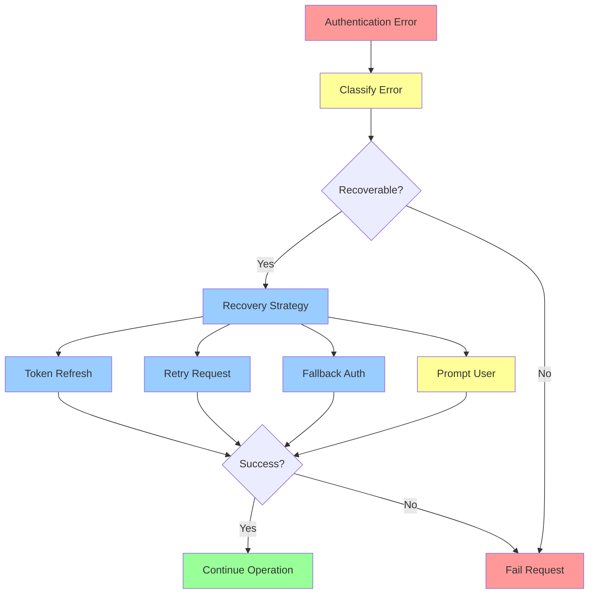
```mermaid
flowchart TD
    Error[Authentication Error] --> Classify[Classify Error]
    
    Classify --> Recoverable{Recoverable?}
    
    Recoverable -->|Yes| Strategy[Recovery Strategy]
    Recoverable -->|No| Fail[Fail Request]
    
    Strategy --> TokenRefresh[Token Refresh]
    Strategy --> Retry[Retry Request]
    Strategy --> Fallback[Fallback Auth]
    Strategy --> UserPrompt[Prompt User]
    
    TokenRefresh --> Success{Success?}
    Retry --> Success
    Fallback --> Success
    UserPrompt --> Success
    
    Success -->|Yes| Continue[Continue Operation]
    Success -->|No| Fail
    
    style Error fill:#f99
    style Classify fill:#ff9
    style Strategy fill:#9cf
    style TokenRefresh fill:#9cf
    style Retry fill:#9cf
    style Fallback fill:#9cf
    style UserPrompt fill:#ff9
    style Continue fill:#9f9
    style Fail fill:#f99
```

## Compliance and Standards

### 1. Standards Compliance

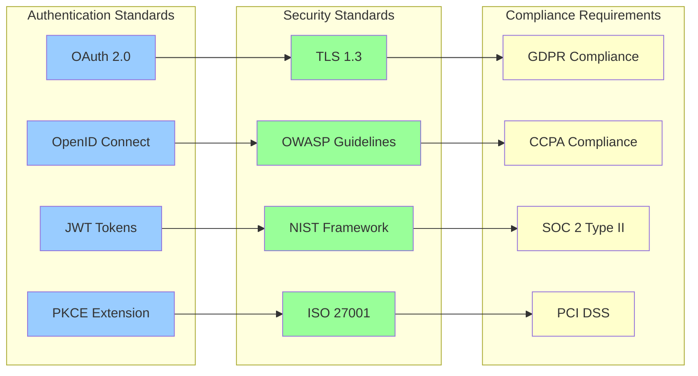
```mermaid
graph LR
    subgraph "Authentication Standards"
        OAuth2[OAuth 2.0]
        OIDC[OpenID Connect]
        JWT[JWT Tokens]
        PKCE[PKCE Extension]
    end
    
    subgraph "Security Standards"
        TLS13[TLS 1.3]
        OWASP[OWASP Guidelines]
        NIST[NIST Framework]
        ISO27001[ISO 27001]
    end
    
    subgraph "Compliance Requirements"
        GDPR[GDPR Compliance]
        CCPA[CCPA Compliance]
        SOC2[SOC 2 Type II]
        PCI[PCI DSS]
    end
    
    OAuth2 --> TLS13
    OIDC --> OWASP
    JWT --> NIST
    PKCE --> ISO27001
    
    TLS13 --> GDPR
    OWASP --> CCPA
    NIST --> SOC2
    ISO27001 --> PCI
    
    style OAuth2 fill:#9cf
    style OIDC fill:#9cf
    style JWT fill:#9cf
    style PKCE fill:#9cf
    style TLS13 fill:#9f9
    style OWASP fill:#9f9
    style NIST fill:#9f9
    style ISO27001 fill:#9f9
    style GDPR fill:#ffc
    style CCPA fill:#ffc
    style SOC2 fill:#ffc
    style PCI fill:#ffc
```

### 2. Audit and Logging

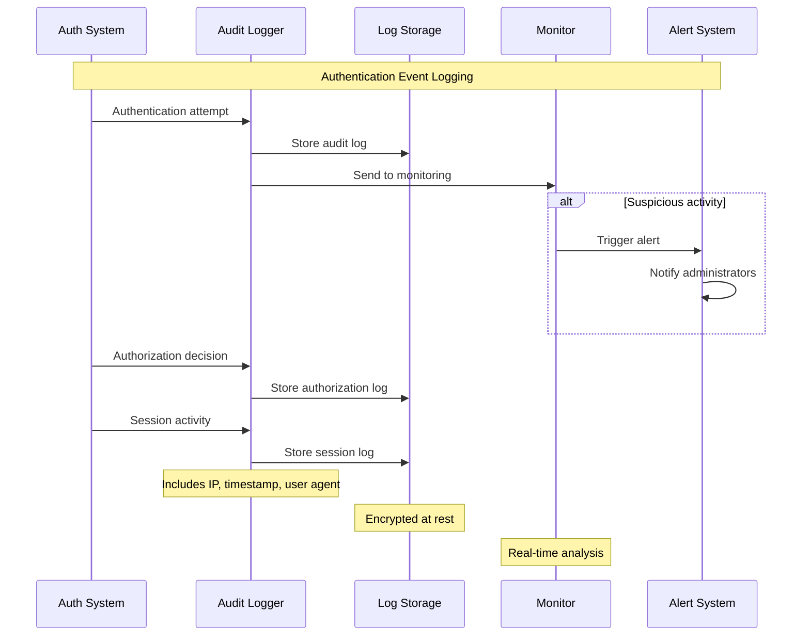
```mermaid
sequenceDiagram
    participant Auth as Auth System
    participant Logger as Audit Logger
    participant Storage as Log Storage
    participant Monitor as Monitor
    participant Alert as Alert System

    Note over Auth, Alert: Authentication Event Logging
    
    Auth->>Logger: Authentication attempt
    Logger->>Storage: Store audit log
    Logger->>Monitor: Send to monitoring
    
    alt Suspicious activity
        Monitor->>Alert: Trigger alert
        Alert->>Alert: Notify administrators
    end
    
    Auth->>Logger: Authorization decision
    Logger->>Storage: Store authorization log
    
    Auth->>Logger: Session activity
    Logger->>Storage: Store session log
    
    Note over Logger: Includes IP, timestamp, user agent
    Note over Storage: Encrypted at rest
    Note over Monitor: Real-time analysis
```

## Performance Considerations

### 1. Authentication Performance

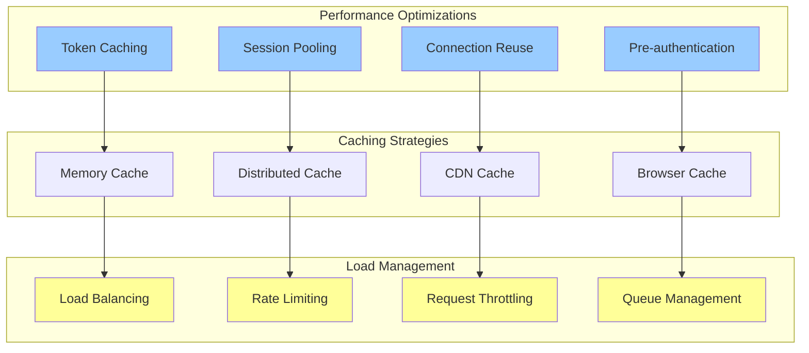
```mermaid
graph TB
    subgraph "Performance Optimizations"
        TokenCaching[Token Caching]
        SessionPooling[Session Pooling]
        ConnectionReuse[Connection Reuse]
        PreAuth[Pre-authentication]
    end
    
    subgraph "Caching Strategies"
        MemoryCache[Memory Cache]
        DistributedCache[Distributed Cache]
        CDNCache[CDN Cache]
        BrowserCache[Browser Cache]
    end
    
    subgraph "Load Management"
        LoadBalancing[Load Balancing]
        RateLimit[Rate Limiting]
        Throttling[Request Throttling]
        QueueManagement[Queue Management]
    end
    
    TokenCaching --> MemoryCache
    SessionPooling --> DistributedCache
    ConnectionReuse --> CDNCache
    PreAuth --> BrowserCache
    
    MemoryCache --> LoadBalancing
    DistributedCache --> RateLimit
    CDNCache --> Throttling
    BrowserCache --> QueueManagement
    
    style TokenCaching fill:#9cf
    style SessionPooling fill:#9cf
    style ConnectionReuse fill:#9cf
    style PreAuth fill:#9cf
    style LoadBalancing fill:#ff9
    style RateLimit fill:#ff9
    style Throttling fill:#ff9
    style QueueManagement fill:#ff9
```

### 2. Scalability Patterns

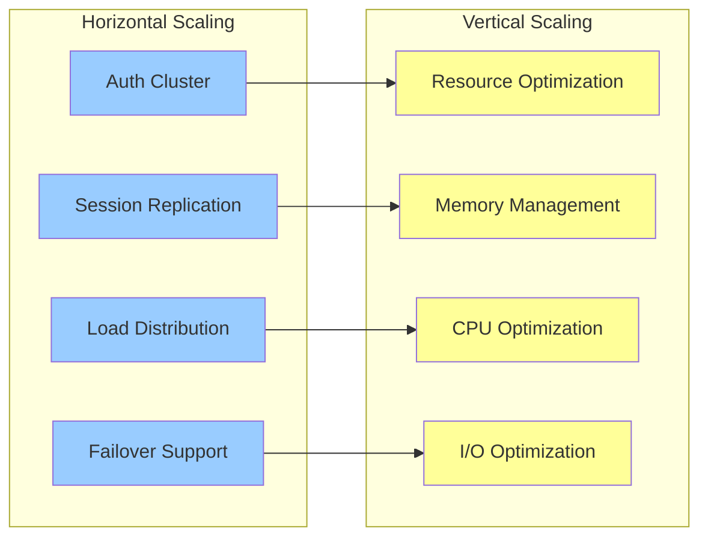
```mermaid
graph LR
    subgraph "Horizontal Scaling"
        AuthCluster[Auth Cluster]
        SessionReplication[Session Replication]
        LoadDistribution[Load Distribution]
        FailoverSupport[Failover Support]
    end
    
    subgraph "Vertical Scaling"
        ResourceOptimization[Resource Optimization]
        MemoryManagement[Memory Management]
        CPUOptimization[CPU Optimization]
        IOOptimization[I/O Optimization]
    end
    
    AuthCluster --> ResourceOptimization
    SessionReplication --> MemoryManagement
    LoadDistribution --> CPUOptimization
    FailoverSupport --> IOOptimization
    
    style AuthCluster fill:#9cf
    style SessionReplication fill:#9cf
    style LoadDistribution fill:#9cf
    style FailoverSupport fill:#9cf
    style ResourceOptimization fill:#ff9
    style MemoryManagement fill:#ff9
    style CPUOptimization fill:#ff9
    style IOOptimization fill:#ff9
```