# CLI Tool Architecture

This document details the architecture of the Tento CLI tool, which provides command-line interface for schema management and synchronization with Shopify.

## CLI Overview

The Tento CLI is a command-line tool that allows developers to manage metaobject schemas, synchronize between local definitions and Shopify, and perform various administrative tasks.

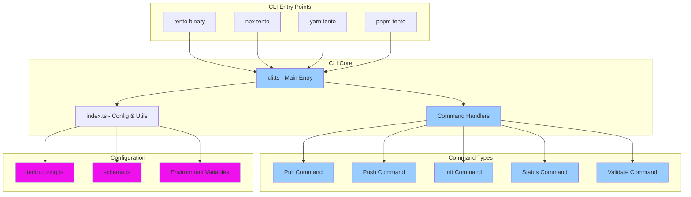

## Command Architecture

### 1. Command Structure

Each CLI command follows a consistent pattern for processing and execution:

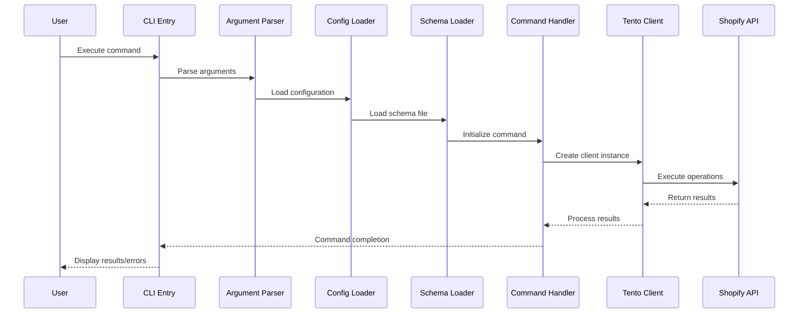

### 2. Configuration System

The CLI uses a layered configuration approach:

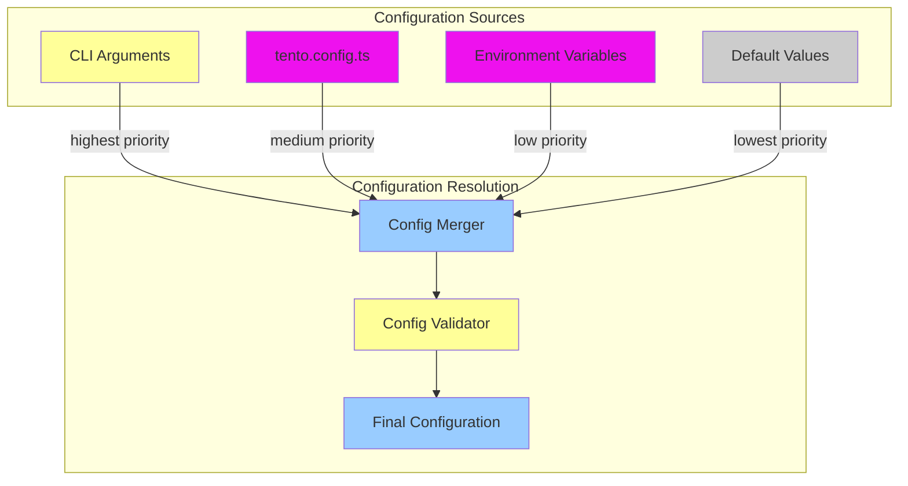

## Command Implementations

### 1. Pull Command

Synchronizes remote Shopify schema to local files:

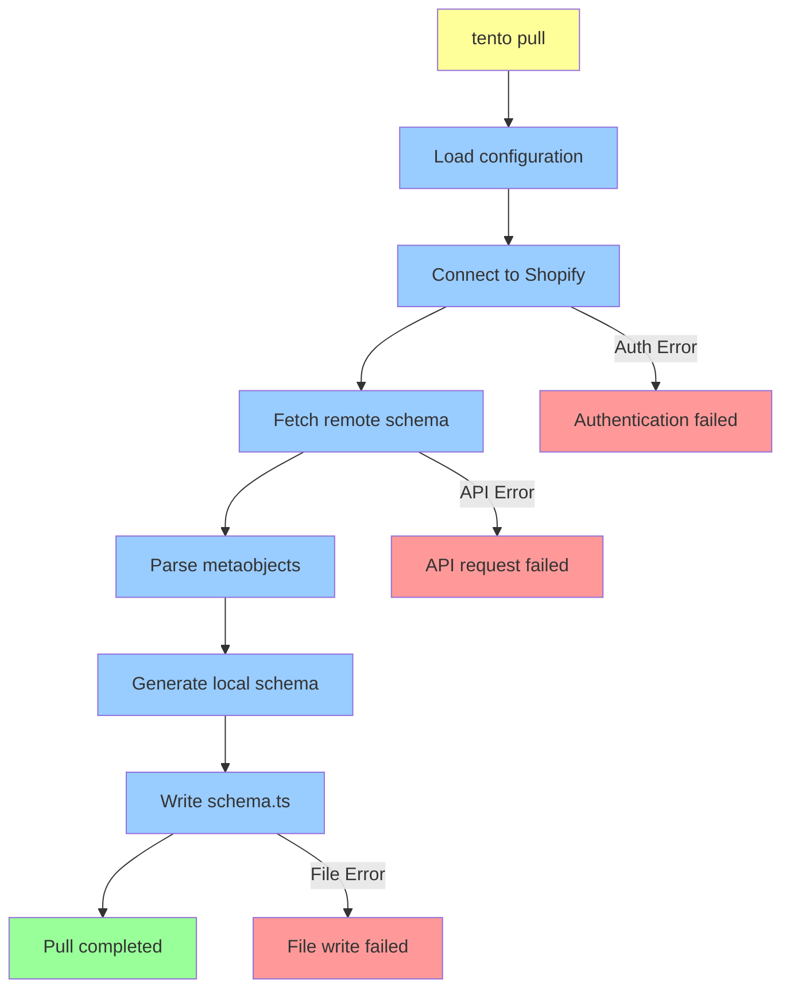

### 2. Push Command

Applies local schema changes to Shopify:

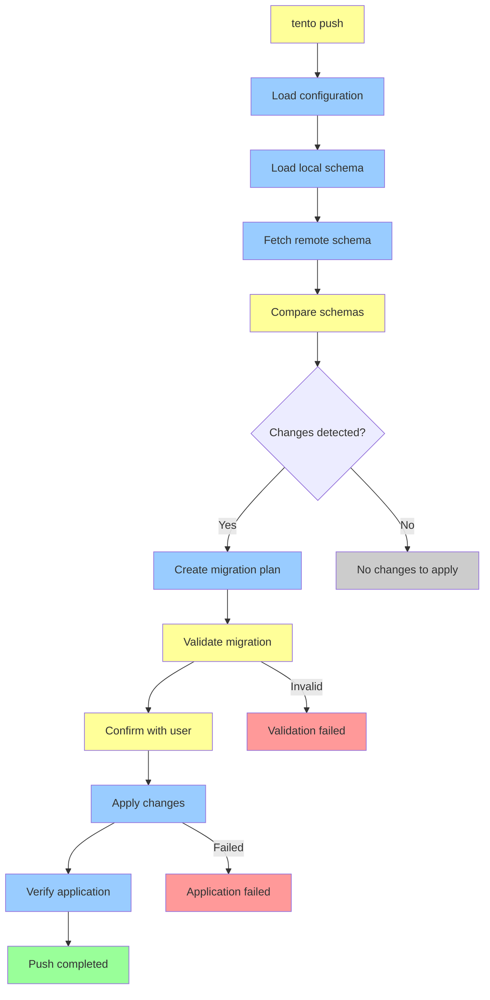

### 3. Status Command

Shows the current state of schema synchronization:

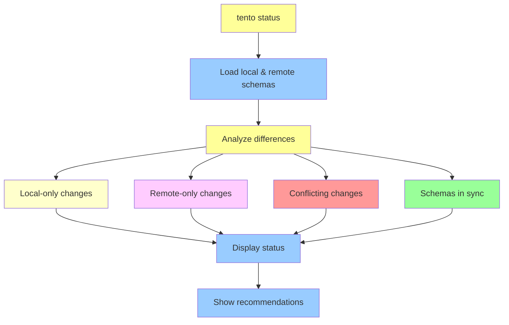

## Schema Processing Pipeline

### 1. Local Schema Reading

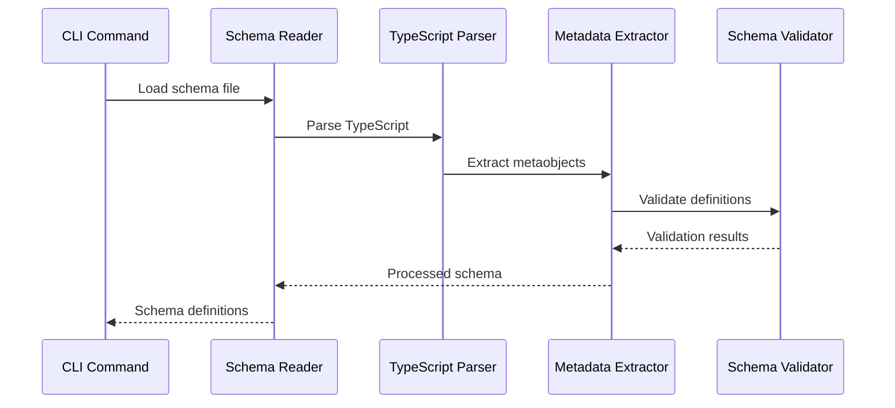

### 2. Remote Schema Fetching

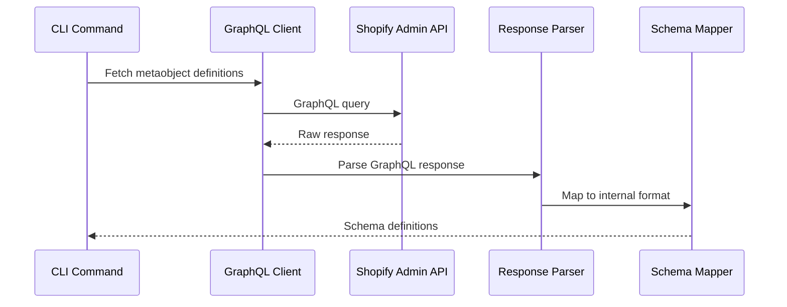

### 3. Schema Comparison

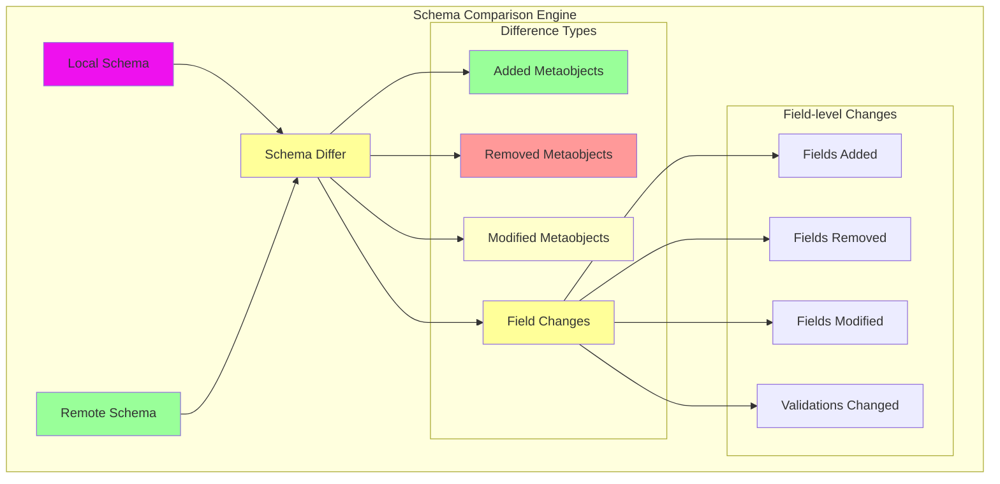

## Error Handling and User Experience

### 1. Error Classification

```mermaid
graph TB
    Errors[CLI Errors] --> Config[Configuration Errors]
    Errors --> Auth[Authentication Errors]
    Errors --> Network[Network Errors]
    Errors --> Schema[Schema Errors]
    Errors --> File[File System Errors]
    
    Config --> MissingConfig[Missing config file]
    Config --> InvalidConfig[Invalid configuration]
    Config --> MissingShop[Missing shop parameter]
    
    Auth --> InvalidToken[Invalid access token]
    Auth --> InsufficientPermissions[Insufficient permissions]
    Auth --> ExpiredToken[Expired token]
    
    Network --> ConnectionFailed[Connection failed]
    Network --> Timeout[Request timeout]
    Network --> RateLimit[Rate limit exceeded]
    
    Schema --> ParseError[Schema parse error]
    Schema --> ValidationError[Validation error]
    Schema --> ConflictError[Schema conflict]
    
    File --> FileNotFound[File not found]
    File --> PermissionDenied[Permission denied]
    File --> DiskFull[Disk full]
    
    style Errors fill:#f99
    style Config fill:#f99
    style Auth fill:#f99
    style Network fill:#f99
    style Schema fill:#f99
    style File fill:#f99
```

### 2. User Feedback System

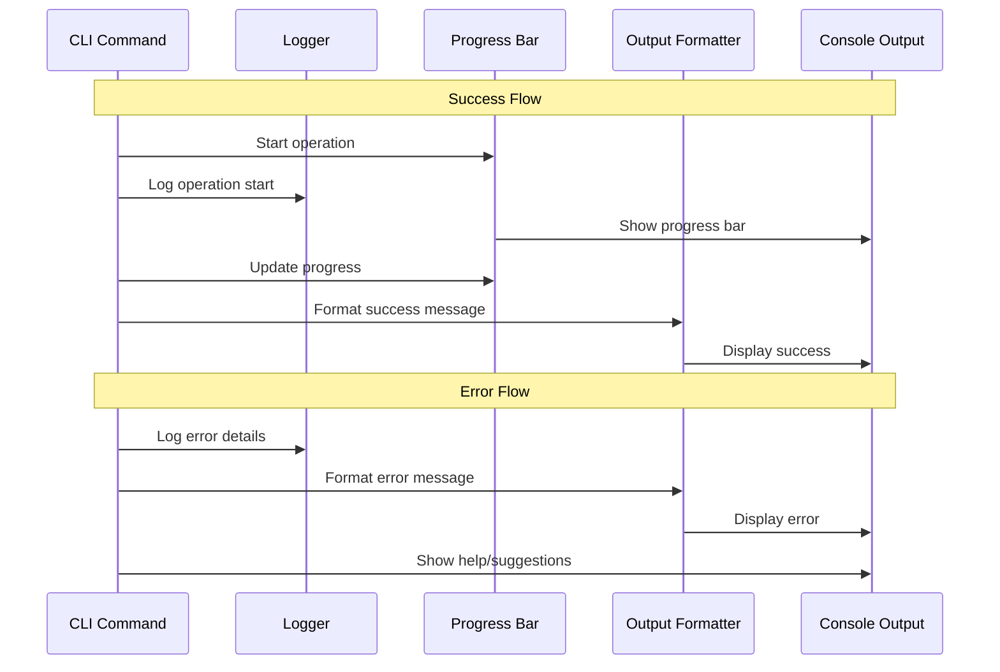

## Configuration Management

### 1. Configuration Schema

```typescript
// tento.config.ts structure
interface TentoConfig {
  // Required: Shop identifier
  shop: string;
  
  // Required: Path to schema file
  schemaPath: string;
  
  // Required: Authentication headers
  headers: {
    'X-Shopify-Access-Token': string;
    [key: string]: string;
  };
  
  // Optional: API configuration
  api?: {
    version?: string;
    timeout?: number;
    retries?: number;
  };
  
  // Optional: CLI behavior
  cli?: {
    verbose?: boolean;
    autoConfirm?: boolean;
    outputFormat?: 'table' | 'json' | 'yaml';
  };
}
```

### 2. Environment Variable Support

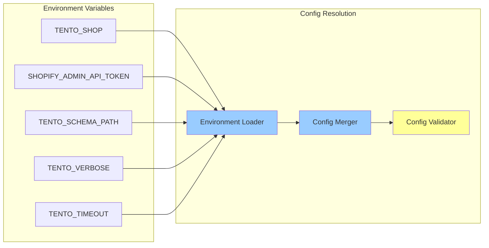

## Output and Reporting

### 1. Output Formats

The CLI supports multiple output formats for different use cases:

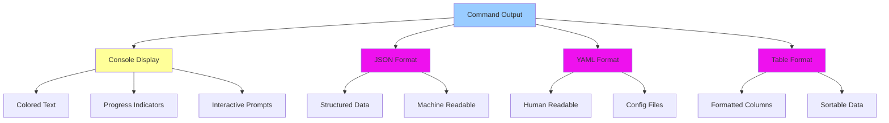

### 2. Progress Reporting

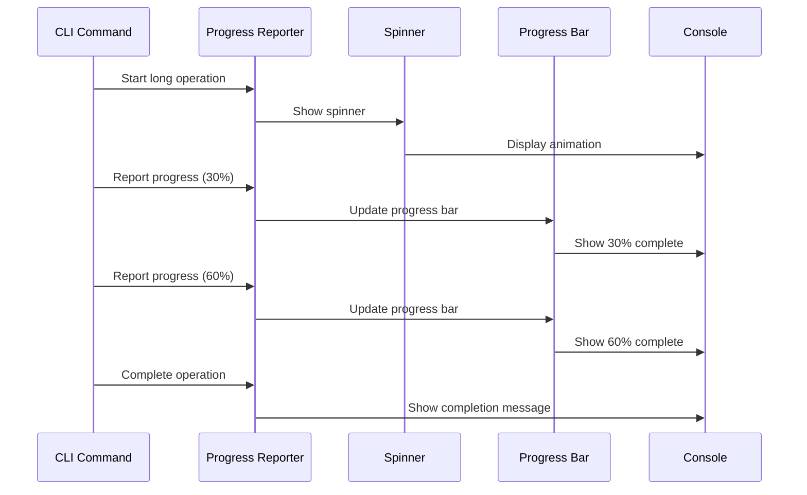

## Testing Architecture

### 1. Test Structure

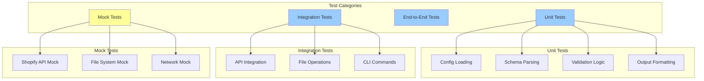

### 2. Test Execution Pipeline

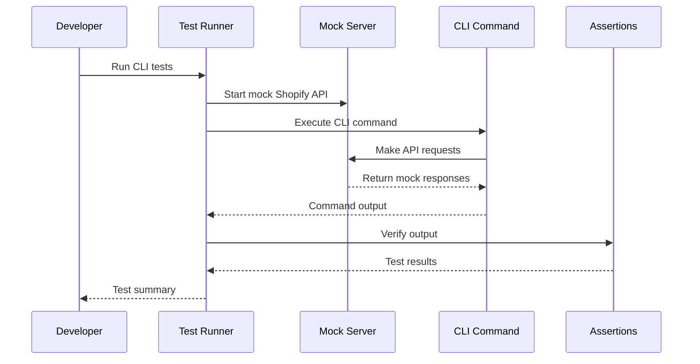

## Performance Considerations

### 1. Command Execution Optimization

- **Lazy Loading**: Load heavy dependencies only when needed
- **Parallel Processing**: Execute independent operations concurrently
- **Caching**: Cache frequently accessed data like schema definitions
- **Streaming**: Process large datasets as streams rather than loading entirely into memory

### 2. Network Optimization

- **Request Batching**: Combine multiple API requests when possible
- **Compression**: Compress request/response payloads
- **Connection Reuse**: Maintain persistent connections for multiple requests
- **Retry Logic**: Implement exponential backoff for failed requests

### 3. Memory Management

- **Resource Cleanup**: Properly dispose of resources after use
- **Stream Processing**: Use streams for large file operations
- **Garbage Collection**: Minimize object creation in hot paths
- **Memory Monitoring**: Track memory usage for long-running operations