# Client Library Architecture

This document details the internal architecture of the Tento client library, which provides type-safe interactions with Shopify metaobjects.

## Client Library Overview

The client library is the core component that developers interact with directly. It provides a fluent API for defining, validating, and querying Shopify metaobjects.

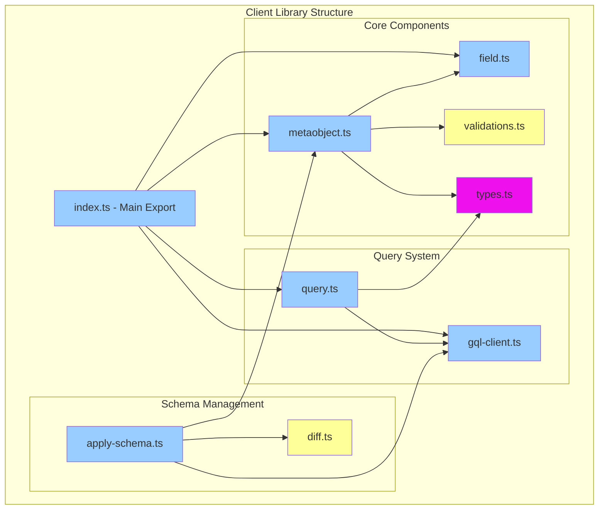

## Core Components Deep Dive

### 1. Metaobject System (`metaobject.ts`)

The central component for defining and managing metaobject schemas:

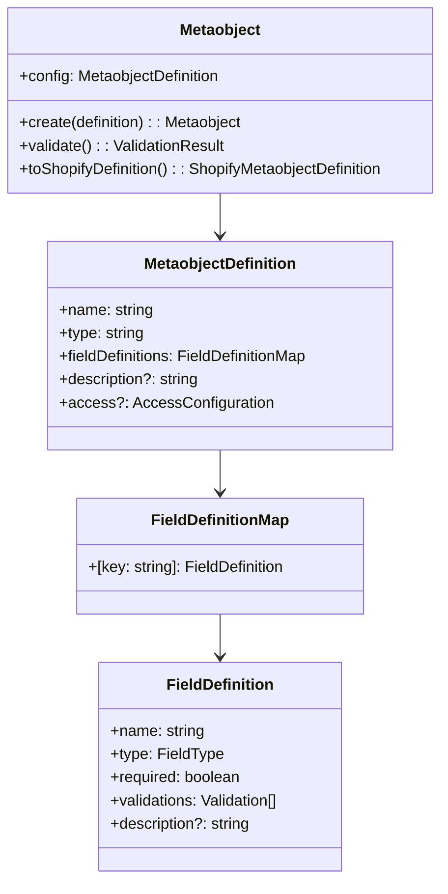

### 2. Field System (`field.ts`)

Provides typed field definitions with validation support:

```mermaid
graph TB
    subgraph "Field Types"
        SingleLine[Single Line Text]
        MultiLine[Multi Line Text]
        Integer[Integer]
        Decimal[Decimal]
        Date[Date]
        DateTime[Date Time]
        URL[URL]
        Boolean[Boolean]
        FileRef[File Reference]
        ProductRef[Product Reference]
        Dimension[Dimension]
        Volume[Volume]
        Weight[Weight]
        Rating[Rating]
        Color[Color]
        JSON[JSON]
    end
    
    subgraph "Field Builder"
        Builder[Field Builder Function]
        ValidationChain[Validation Chain]
        TypeSafety[Type Safety Layer]
    end
    
    Builder --> SingleLine
    Builder --> MultiLine
    Builder --> Integer
    Builder --> Decimal
    Builder --> Date
    Builder --> DateTime
    Builder --> URL
    Builder --> Boolean
    Builder --> FileRef
    Builder --> ProductRef
    Builder --> Dimension
    Builder --> Volume
    Builder --> Weight
    Builder --> Rating
    Builder --> Color
    Builder --> JSON
    
    Builder --> ValidationChain
    ValidationChain --> TypeSafety
    
    style Builder fill:#9cf
    style ValidationChain fill:#ff9
    style TypeSafety fill:#ff9
```

### 3. Validation System (`validations.ts`)

Comprehensive validation framework for field values:

```mermaid
graph LR
    subgraph "Validation Types"
        String[String Validations]
        Numeric[Numeric Validations]
        Date[Date Validations]
        URL[URL Validations]
        Custom[Custom Validations]
    end
    
    subgraph "String Validations"
        MinLength[min(length)]
        MaxLength[max(length)]
        Regex[regex(pattern)]
        Enum[oneOf(values)]
    end
    
    subgraph "Numeric Validations"
        MinValue[min(value)]
        MaxValue[max(value)]
        Precision[maxPrecision(digits)]
        Step[step(increment)]
    end
    
    subgraph "Date Validations"
        MinDate[min(date)]
        MaxDate[max(date)]
        DateFormat[format(pattern)]
    end
    
    subgraph "URL Validations"
        AllowedDomains[allowedDomains(list)]
        Protocol[requireProtocol()]
    end
    
    String --> MinLength
    String --> MaxLength
    String --> Regex
    String --> Enum
    
    Numeric --> MinValue
    Numeric --> MaxValue
    Numeric --> Precision
    Numeric --> Step
    
    Date --> MinDate
    Date --> MaxDate
    Date --> DateFormat
    
    URL --> AllowedDomains
    URL --> Protocol
    
    style String fill:#9cf
    style Numeric fill:#9cf
    style Date fill:#9cf
    style URL fill:#9cf
    style Custom fill:#9cf
```

### 4. Query System (`query.ts`)

Type-safe query building and execution:

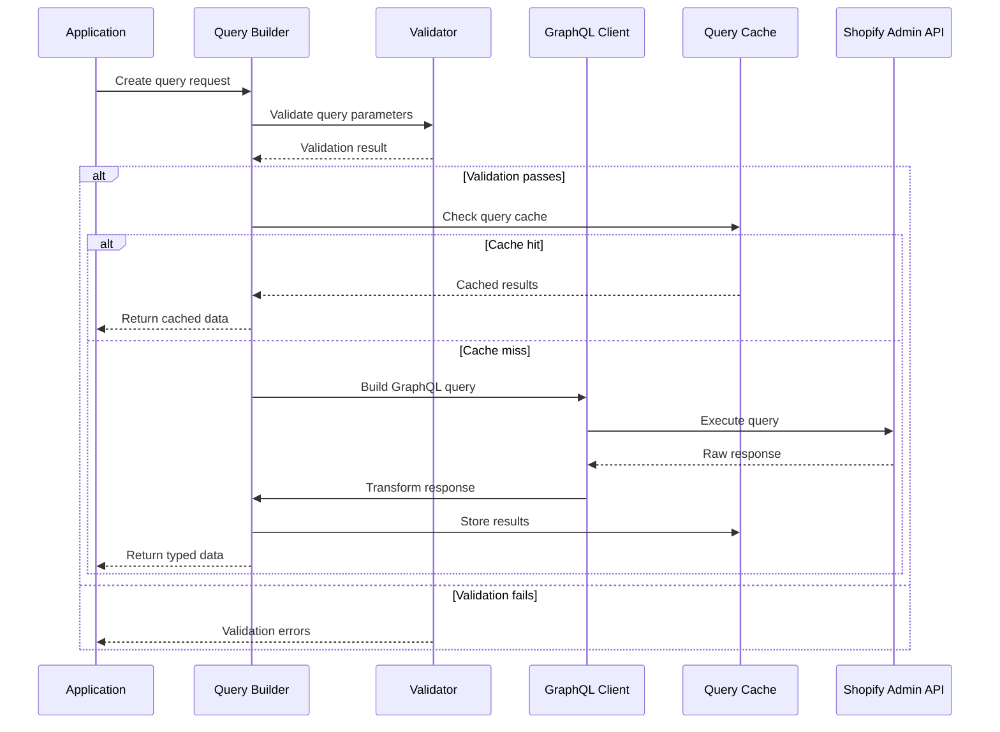

### 5. GraphQL Client (`gql-client.ts`)

Adapter layer for various Shopify GraphQL clients:

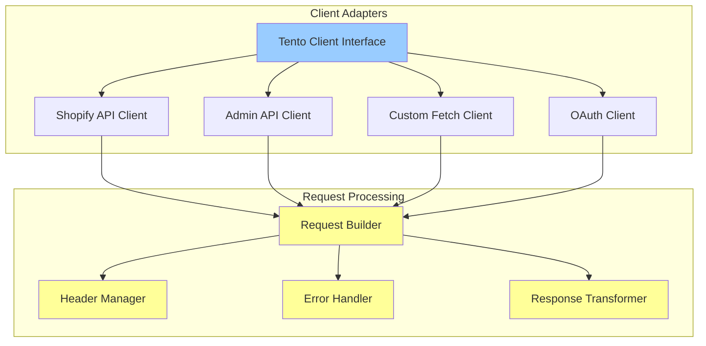

## Data Flow Patterns

### 1. Schema Definition Flow

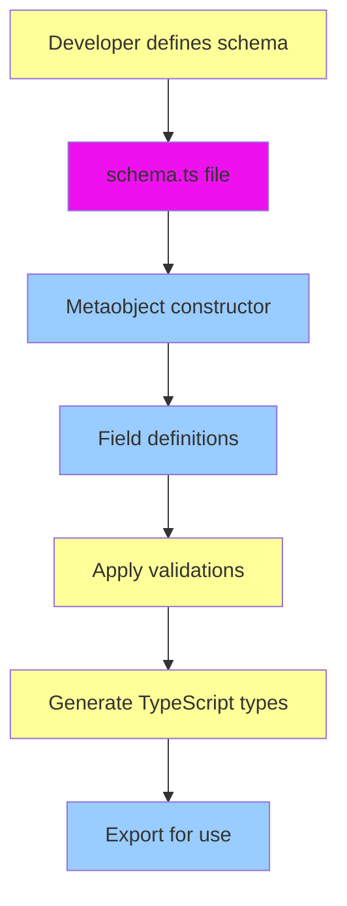

### 2. Query Execution Flow

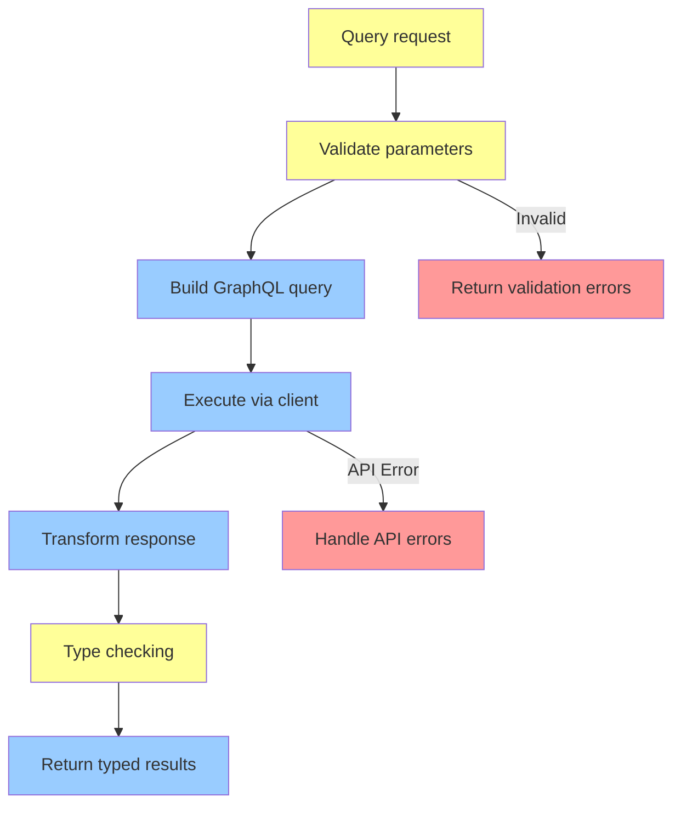

### 3. Schema Application Flow

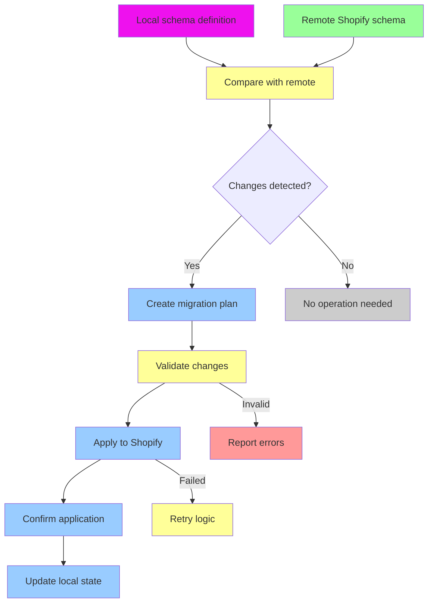

## Type Safety Implementation

### 1. Compile-time Type Safety

```typescript
// Example of type-safe schema definition
export const product = metaobject({
  name: 'Product',
  type: 'product',
  fieldDefinitions: (f) => ({
    title: f.singleLineTextField({
      name: 'Title',
      required: true,
      validations: (v) => [v.min(1), v.max(100)]
    }),
    price: f.decimal({
      name: 'Price', 
      required: true,
      validations: (v) => [v.min(0), v.maxPrecision(2)]
    })
  })
});

// Type is automatically inferred:
// {
//   _id: string;
//   _handle: string;
//   _updatedAt: Date;
//   title: string;
//   price: number;
// }
```

### 2. Runtime Validation Integration

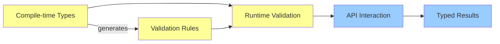

## Error Handling Strategy

### 1. Error Categories

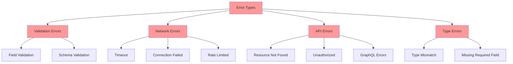

### 2. Error Recovery Patterns

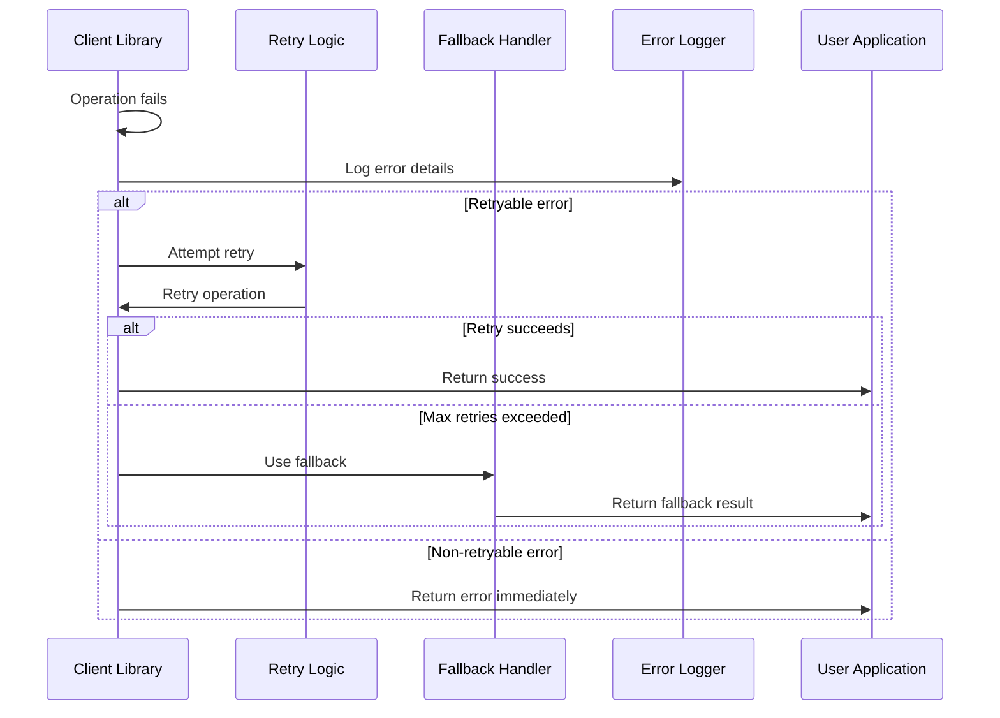

## Performance Optimizations

### 1. Query Optimization

- **Field Selection**: Only request needed fields from GraphQL API
- **Batch Queries**: Combine multiple requests when possible
- **Query Caching**: Cache frequently used queries
- **Pagination**: Efficient handling of large datasets

### 2. Memory Management

- **Lazy Loading**: Load schema definitions on demand
- **Object Pooling**: Reuse validation objects
- **Stream Processing**: Handle large responses as streams
- **Garbage Collection**: Proper cleanup of resources

### 3. Network Optimization

- **Request Compression**: Compress GraphQL queries
- **Connection Pooling**: Reuse HTTP connections
- **Retry Strategies**: Exponential backoff for failures
- **Rate Limiting**: Respect Shopify API limits