# Error Handling and Validation Architecture

This document details the comprehensive error handling and validation system in Tento, covering error classification, recovery strategies, and validation patterns.

## Error Handling Overview

Tento implements a multi-layered error handling system that provides comprehensive error recovery, detailed error reporting, and robust validation at every stage of operation.

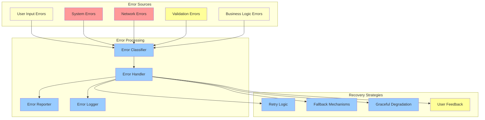

## Error Classification System

### 1. Error Hierarchy

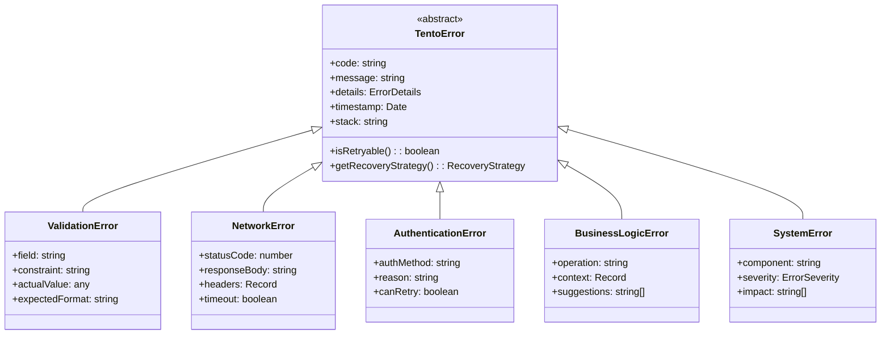

### 2. Error Severity Levels

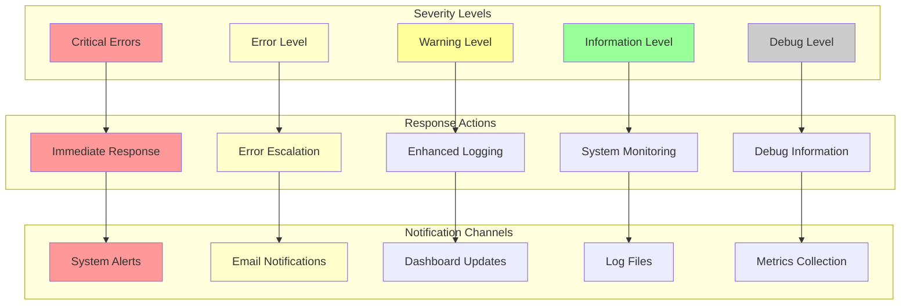

## Validation System Architecture

### 1. Multi-level Validation

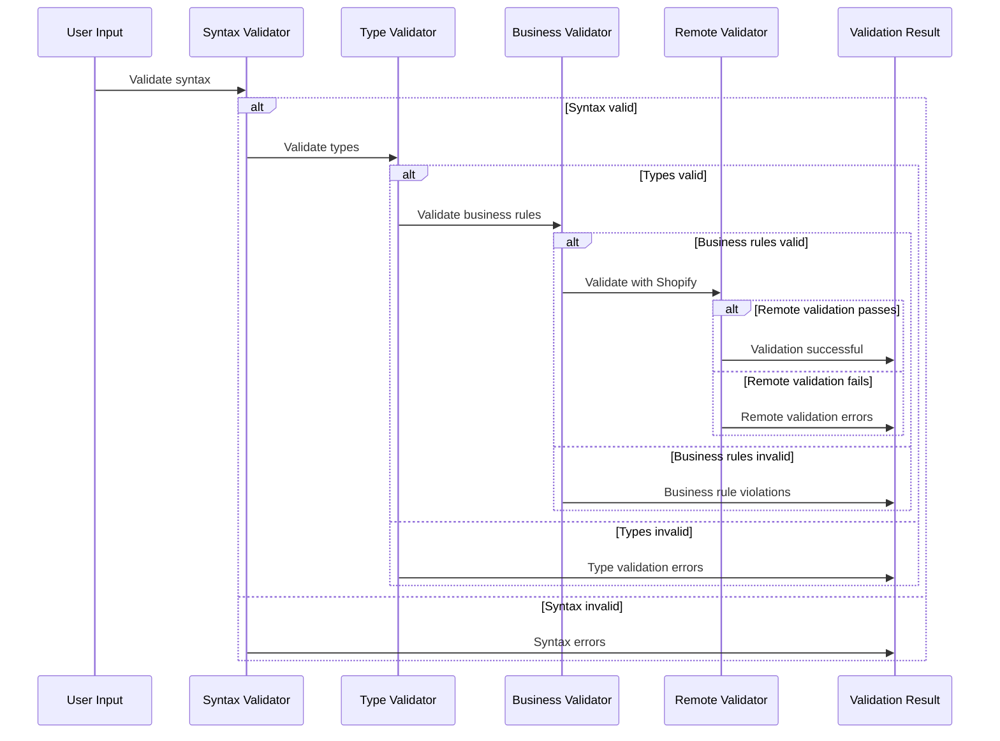

### 2. Validation Rule Engine

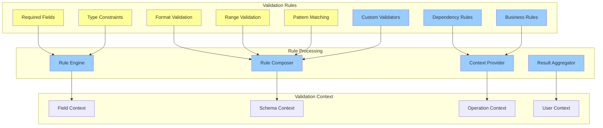

## Error Recovery Strategies

### 1. Retry Mechanisms

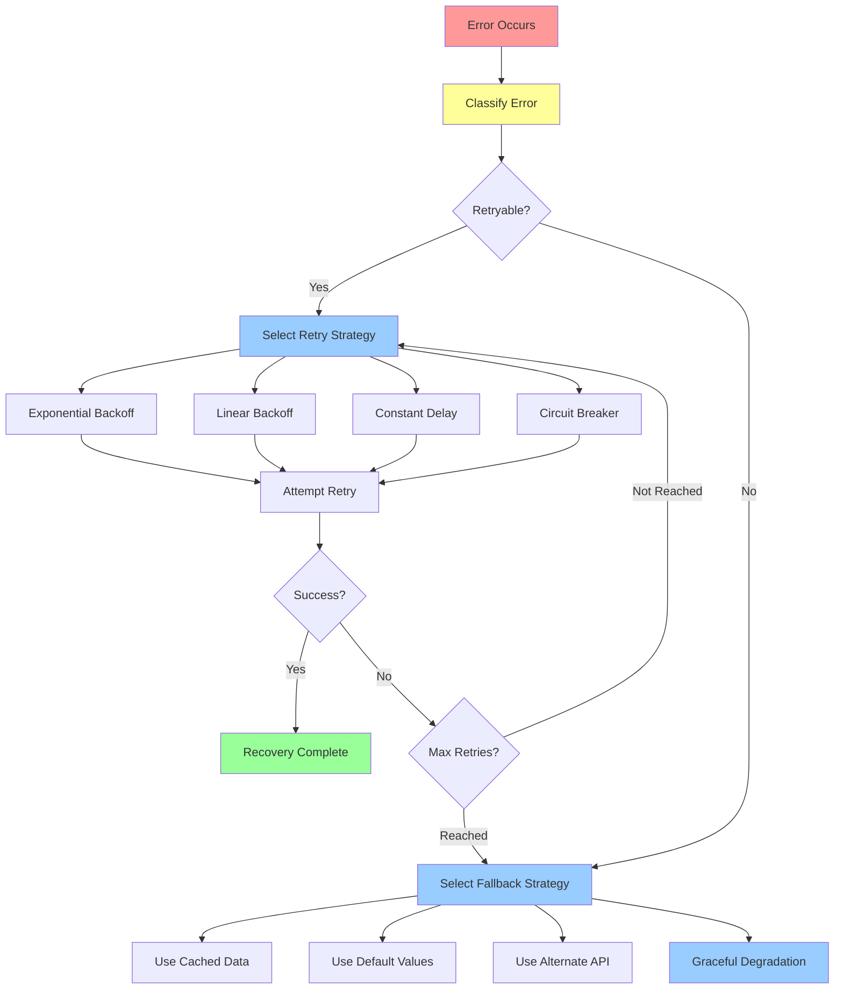

### 2. Circuit Breaker Pattern

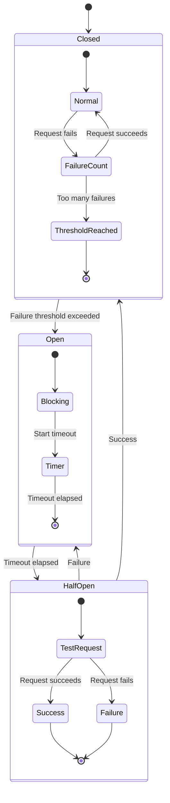

## Validation Patterns

### 1. Field-level Validation

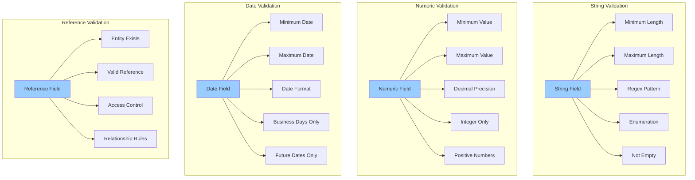

### 2. Schema-level Validation

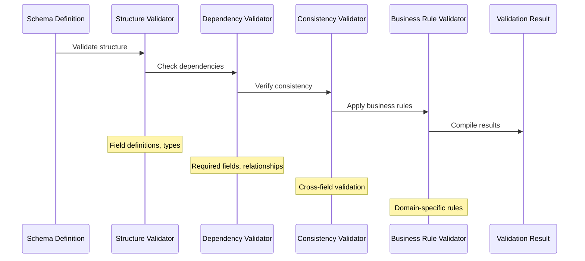

## Error Reporting and Logging

### 1. Error Reporting System

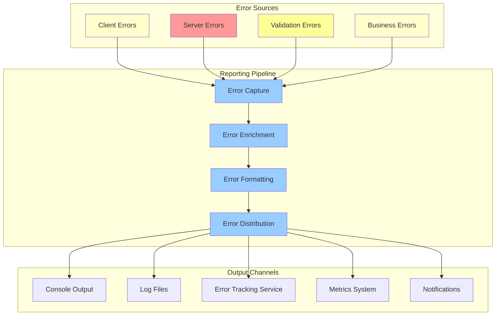

### 2. Structured Logging

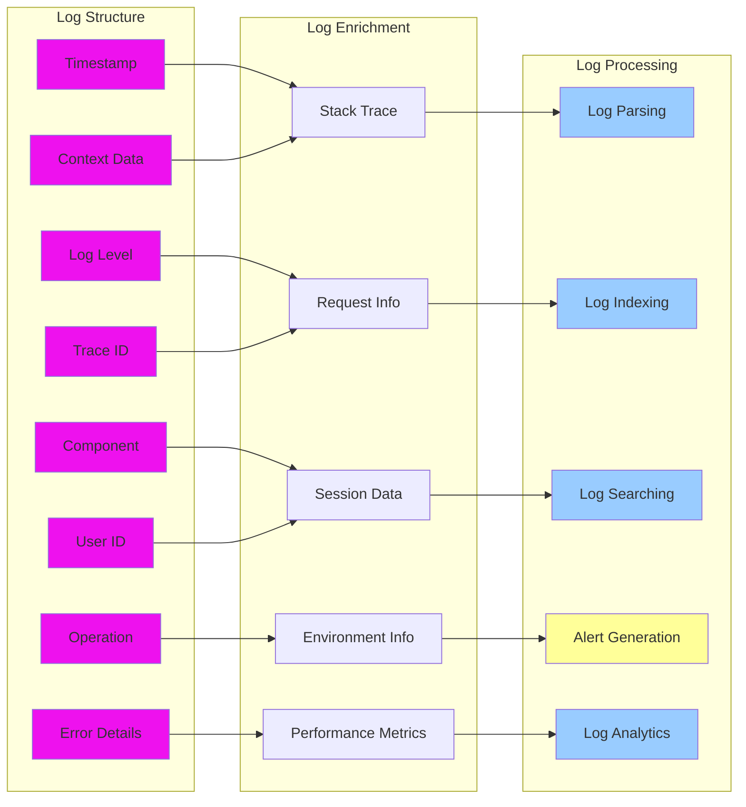

## User Experience and Error Handling

### 1. User-Friendly Error Messages

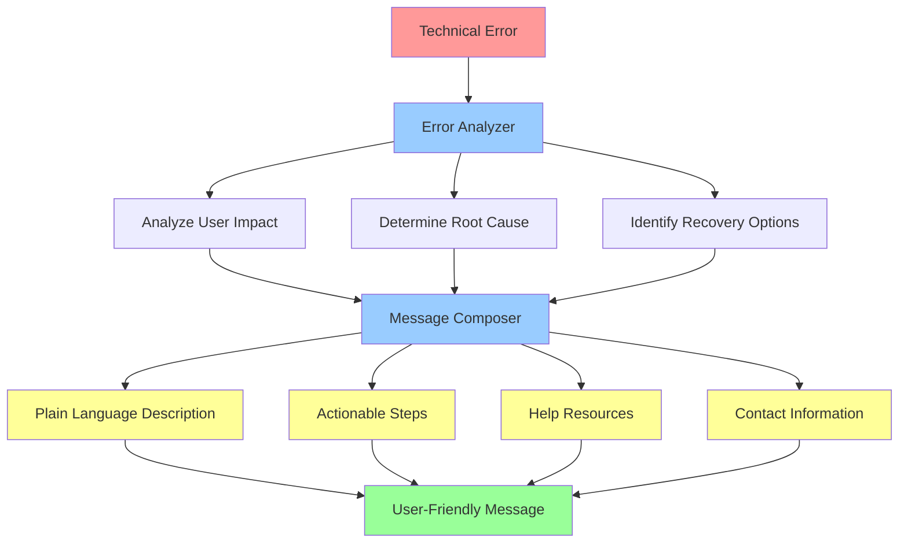

### 2. Progressive Error Disclosure

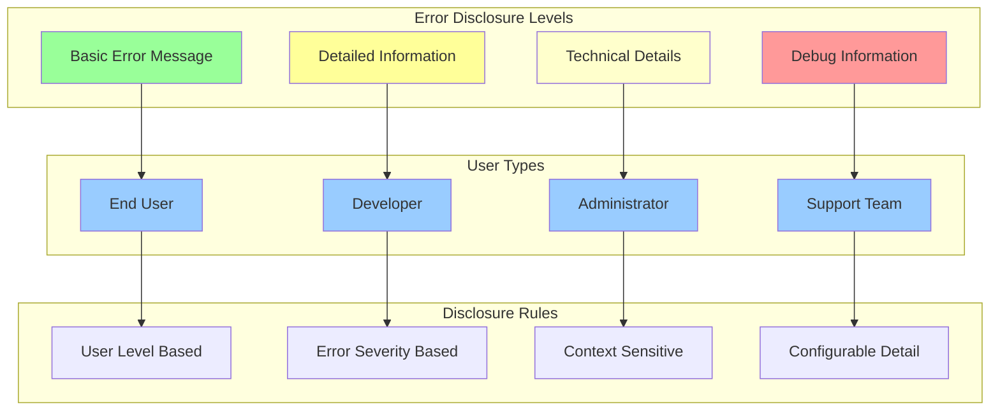

## Performance Impact of Error Handling

### 1. Error Handling Performance

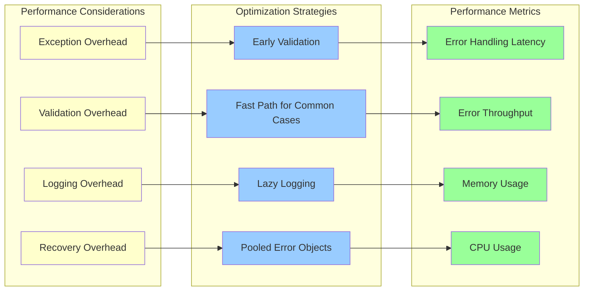

### 2. Error Budget Management

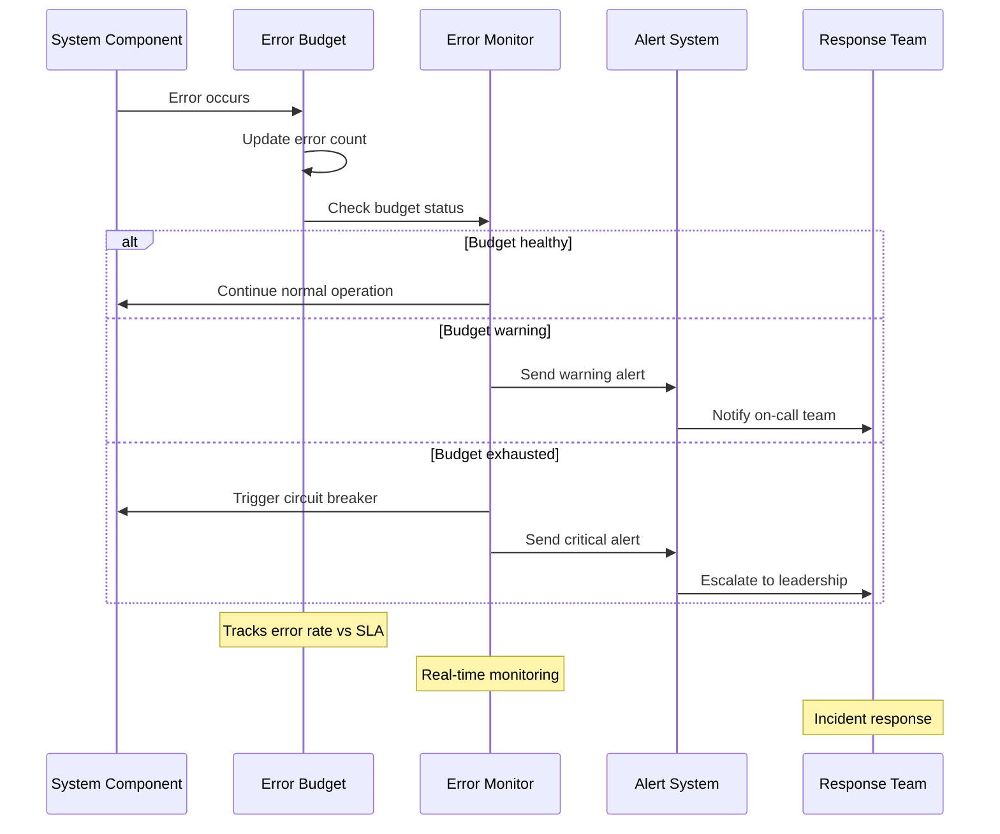

## Testing Error Handling

### 1. Error Testing Strategy

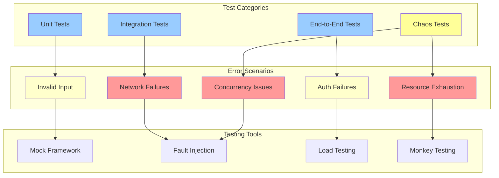

### 2. Automated Error Testing

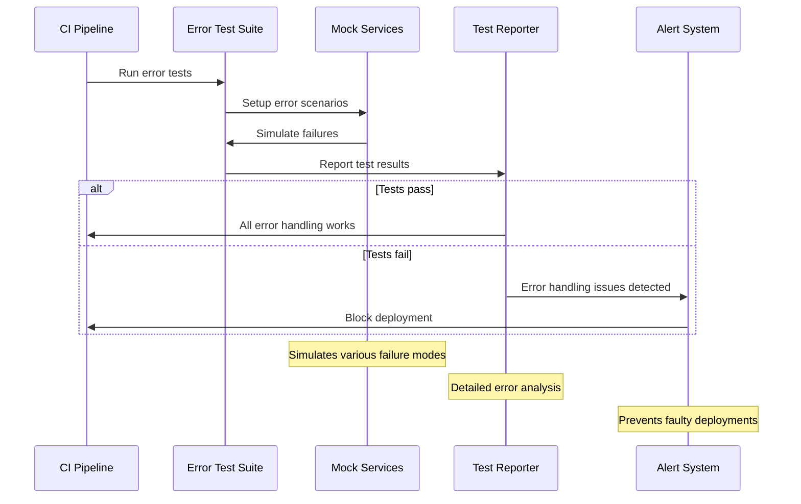

## Monitoring and Alerting

### 1. Error Monitoring Architecture

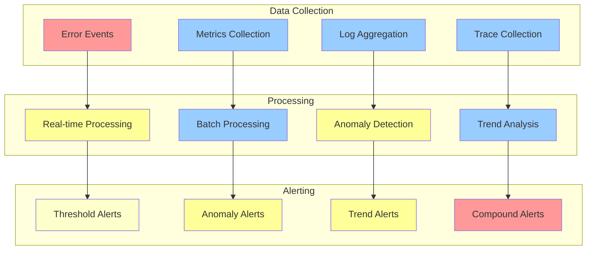

### 2. Incident Response Workflow

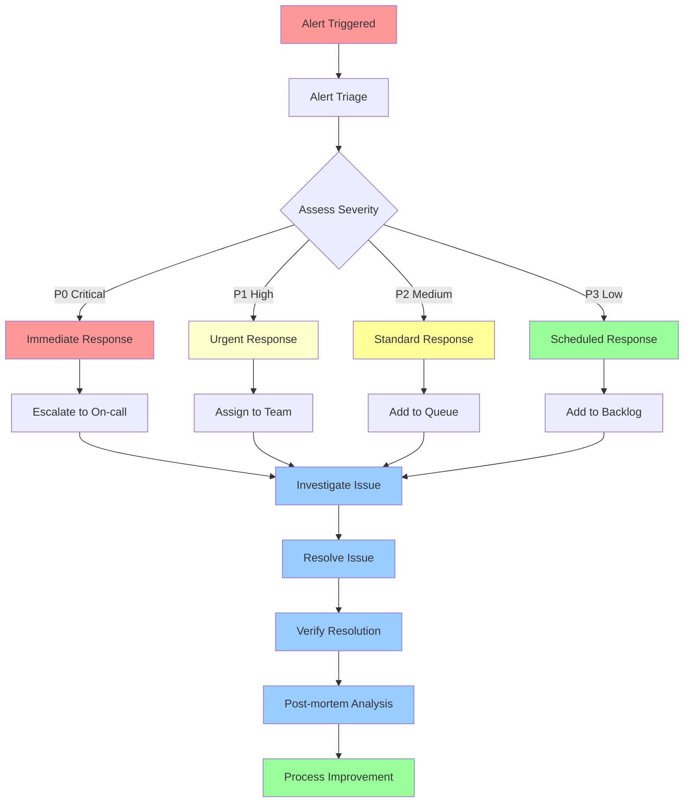