# GraphQL Integration Architecture

This document details how Tento integrates with Shopify's GraphQL Admin API, including type generation, query building, and response handling.

## GraphQL Integration Overview

Tento uses GraphQL as the primary interface to Shopify's Admin API, providing type-safe operations for metaobjects and metafields management.

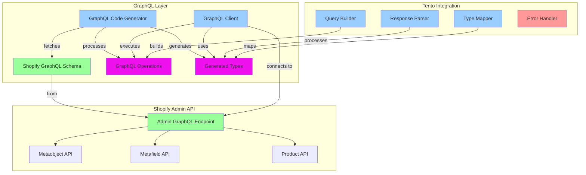

## Code Generation Pipeline

### 1. Schema Introspection

The GraphQL code generator fetches and processes Shopify's schema:

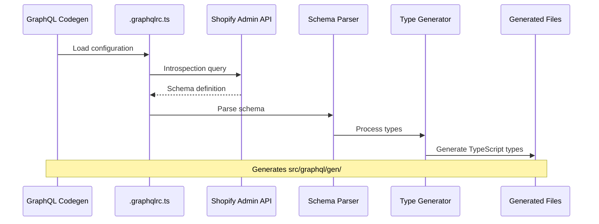

### 2. Operation Processing

GraphQL operations are processed and typed:

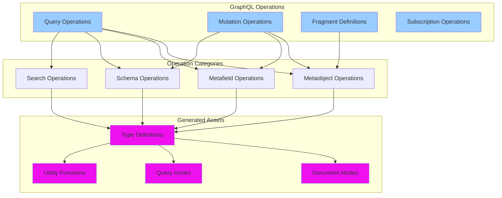

## Query Building System

### 1. Dynamic Query Construction

Tento builds GraphQL queries dynamically based on schema definitions:

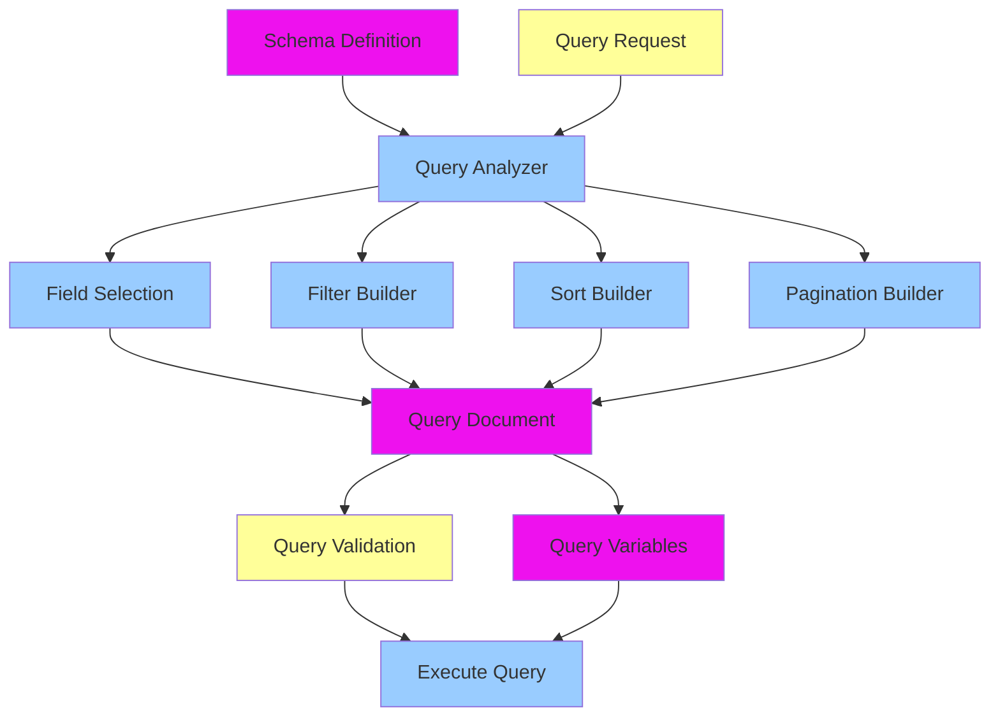

### 2. Query Optimization

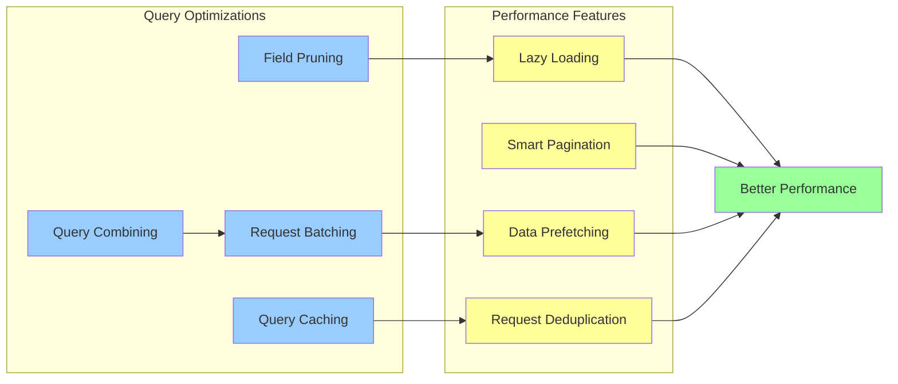

## Type System Integration

### 1. TypeScript Type Generation

```typescript
// Example of generated types
export interface MetaobjectDefinition {
  id: string;
  name: string;
  type: string;
  fieldDefinitions: MetaobjectFieldDefinition[];
  access: MetaobjectAccess;
  capabilities: MetaobjectCapabilities;
}

export interface MetaobjectFieldDefinition {
  key: string;
  name: string;
  type: MetaobjectFieldType;
  required: boolean;
  validations: MetaobjectFieldValidation[];
}

// Query result types
export interface MetaobjectListQuery {
  metaobjects: {
    edges: Array<{
      node: Metaobject;
      cursor: string;
    }>;
    pageInfo: PageInfo;
  };
}
```

### 2. Runtime Type Mapping

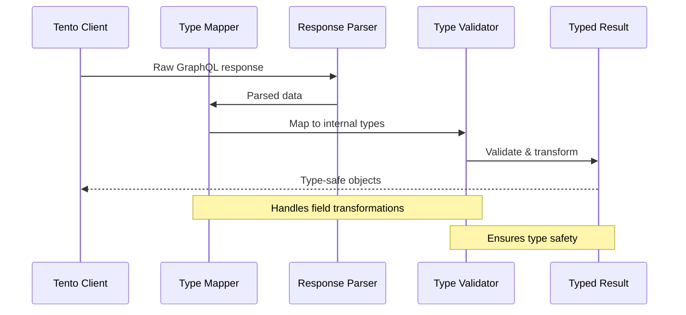

## API Operation Patterns

### 1. Metaobject Operations

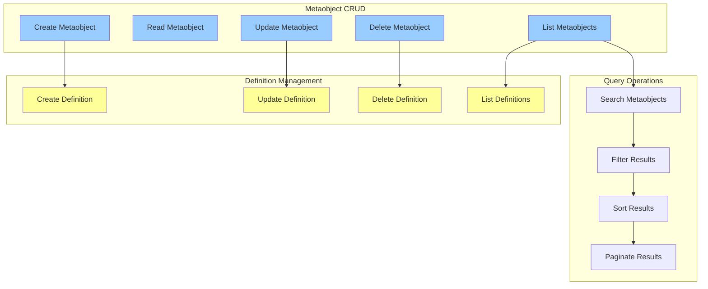

### 2. Schema Synchronization Operations

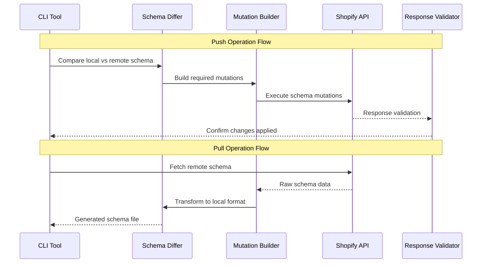

## Error Handling and Resilience

### 1. GraphQL Error Types

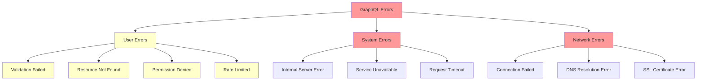

### 2. Error Recovery Strategies

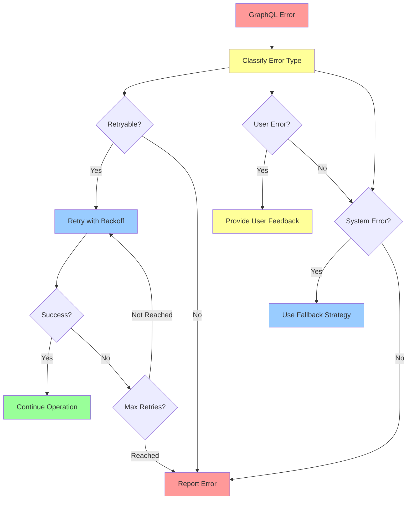

## Authentication and Authorization

### 1. Authentication Flow

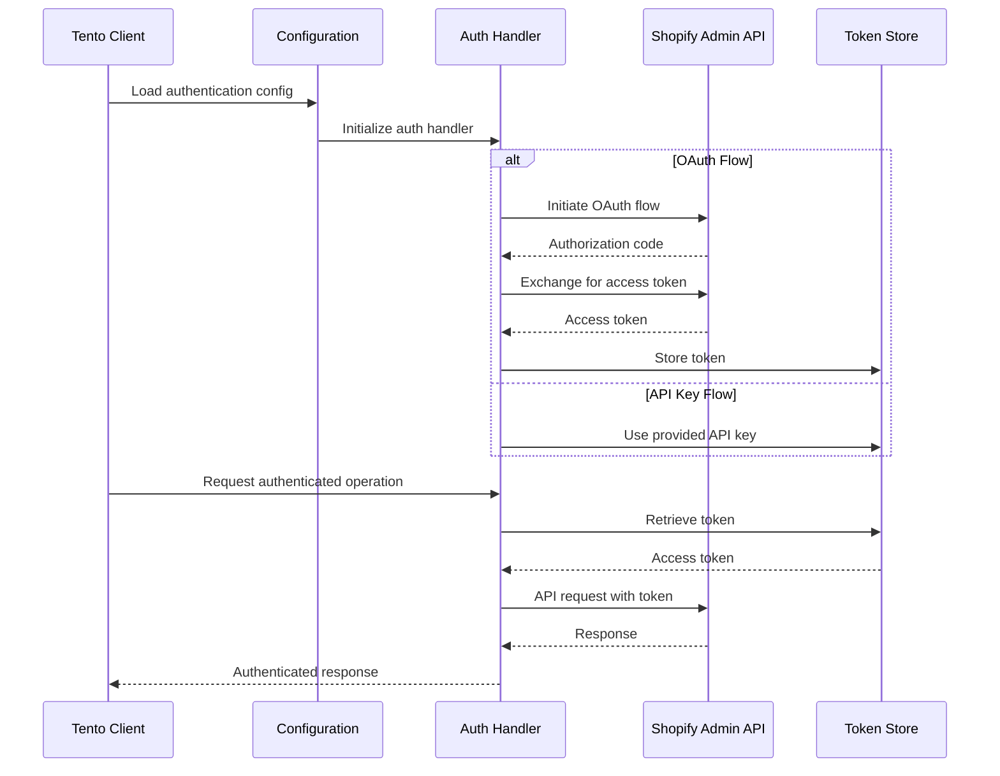

### 2. Permission Management

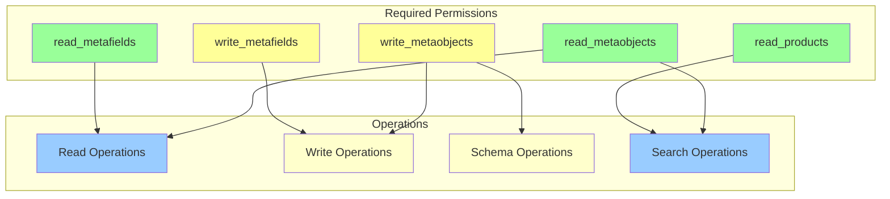

## Performance Optimization

### 1. Query Performance

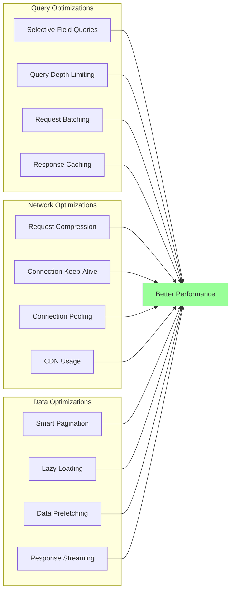

### 2. Rate Limiting Handling

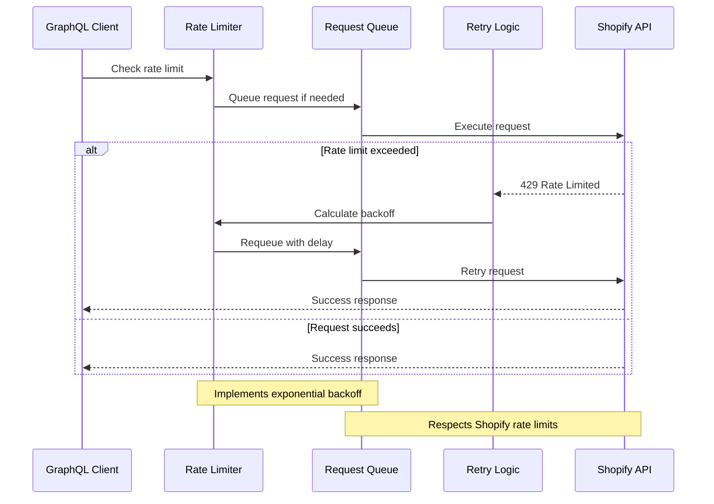

## Data Transformation Pipeline

### 1. Response Processing

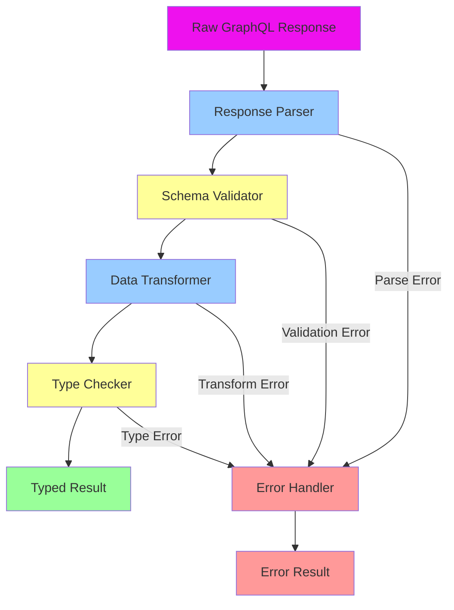

### 2. Field Value Mapping

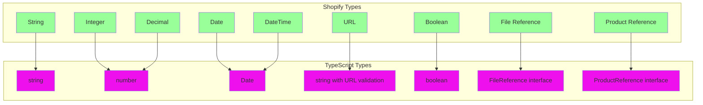

## Integration Testing Strategy

### 1. GraphQL Integration Tests

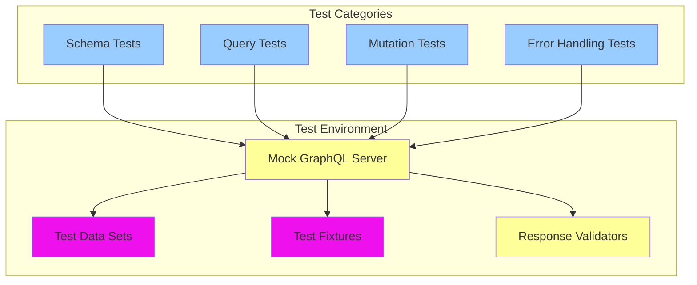

### 2. End-to-End Testing

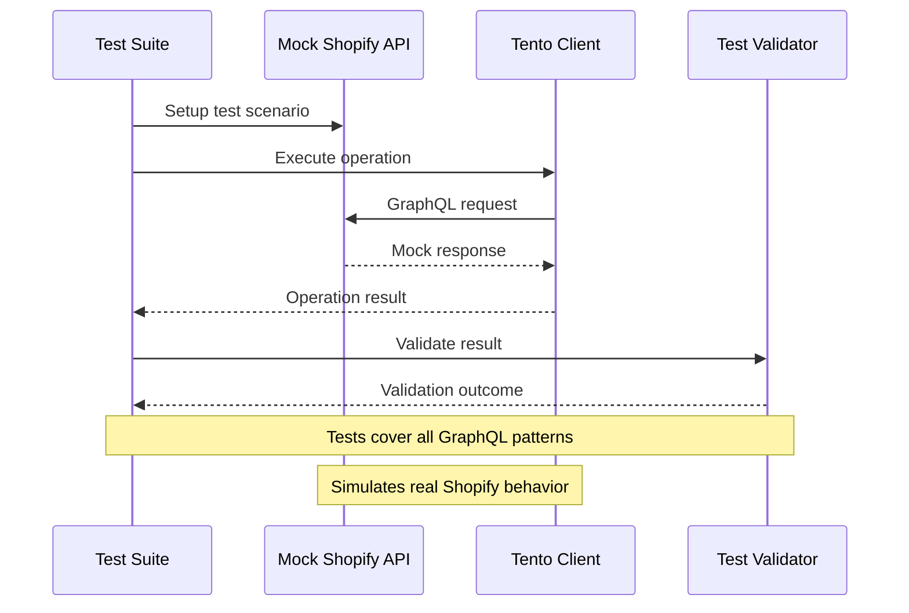