# Schema Management Architecture

This document details the schema management system in Tento, including definition, validation, synchronization, and migration workflows.

## Schema Management Overview

Tento's schema management system provides a complete lifecycle for metaobject schemas, from local definition to Shopify synchronization, ensuring consistency and type safety throughout the process.

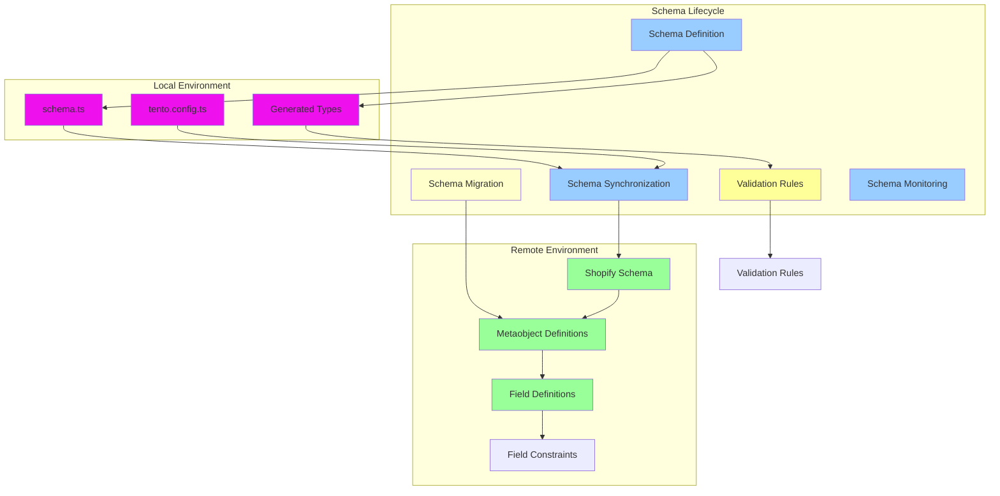

## Schema Definition System

### 1. Schema Definition Language

Tento provides a TypeScript-based DSL for defining metaobject schemas:

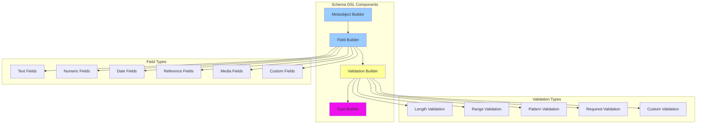

### 2. Schema Composition Patterns

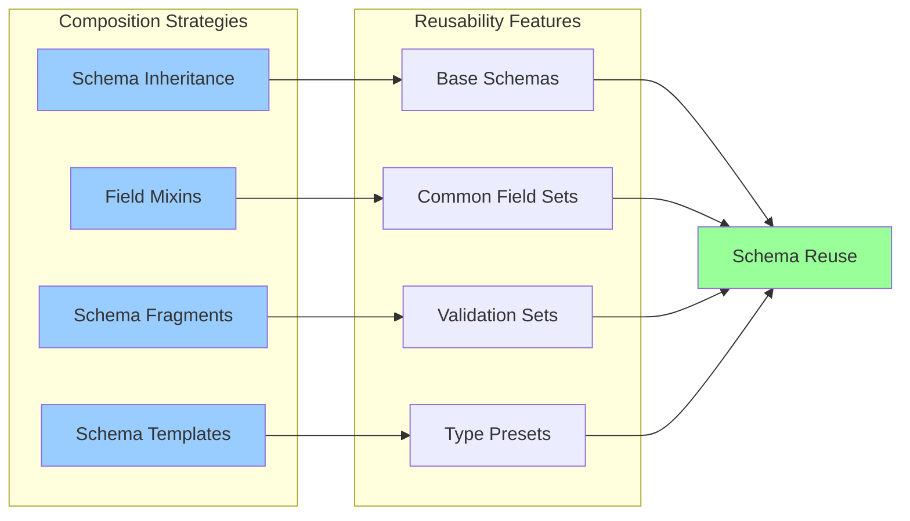

## Validation System Architecture

### 1. Multi-layer Validation

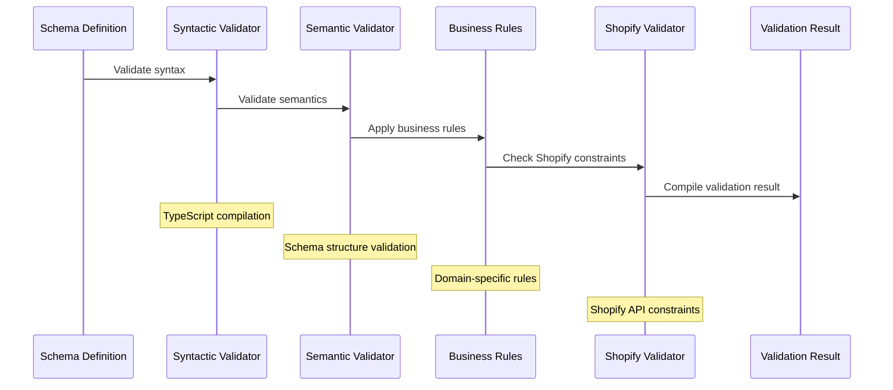

### 2. Validation Rule Engine

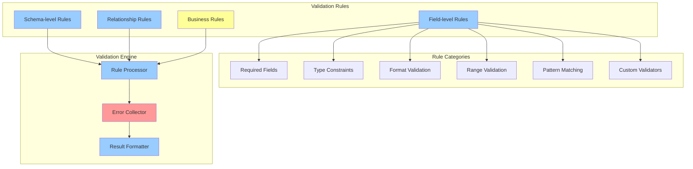

## Schema Synchronization System

### 1. Bidirectional Synchronization

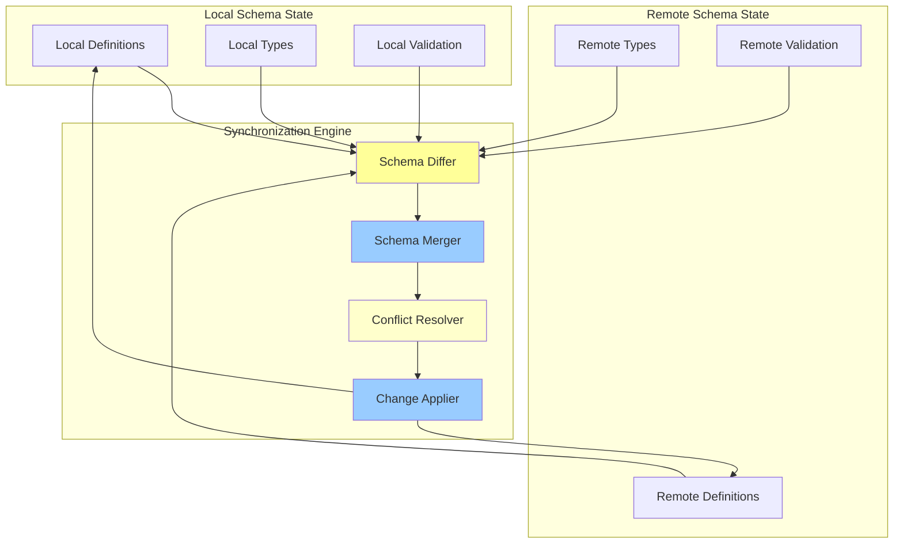

### 2. Change Detection Algorithm

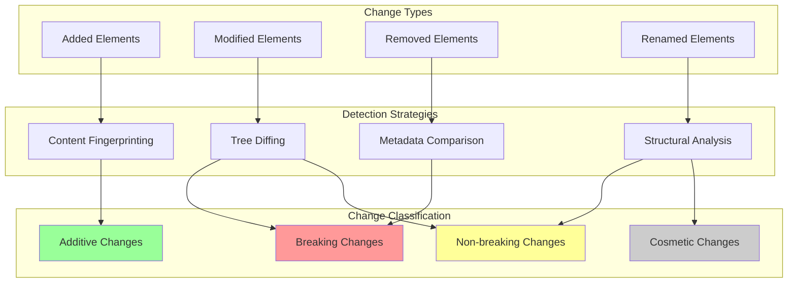

## Migration System

### 1. Migration Planning

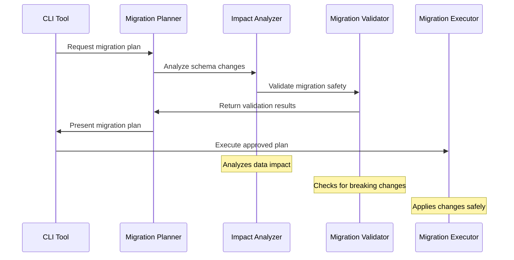

### 2. Migration Strategies

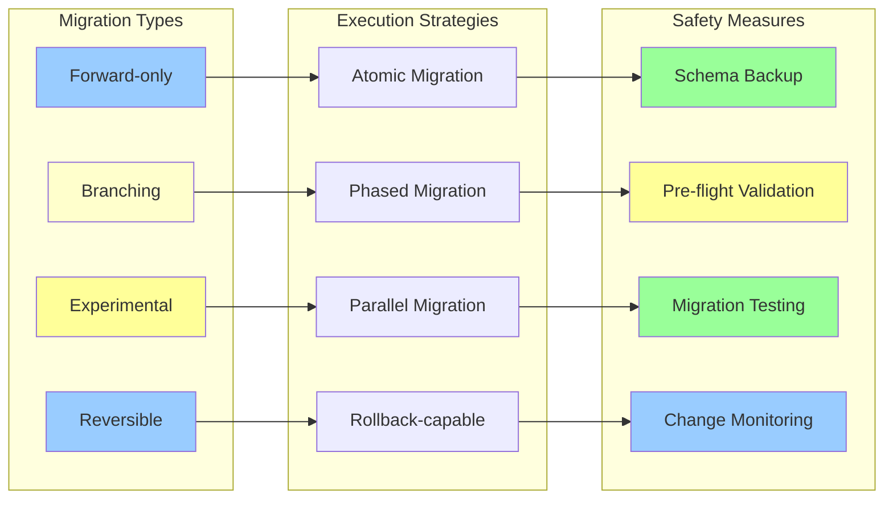

## Data Migration Patterns

### 1. Field Migration Strategies

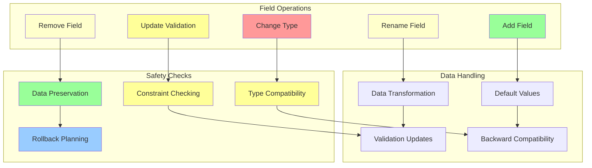

### 2. Migration Execution Flow

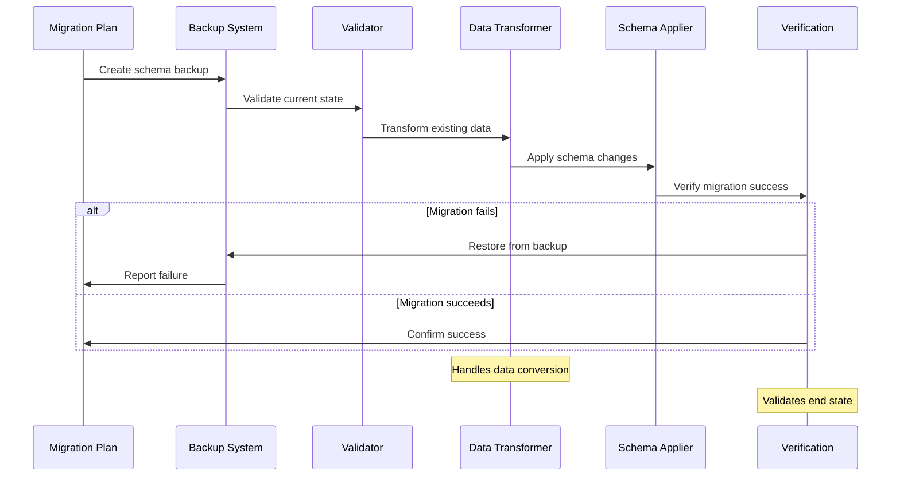

## Schema Versioning System

### 1. Version Management

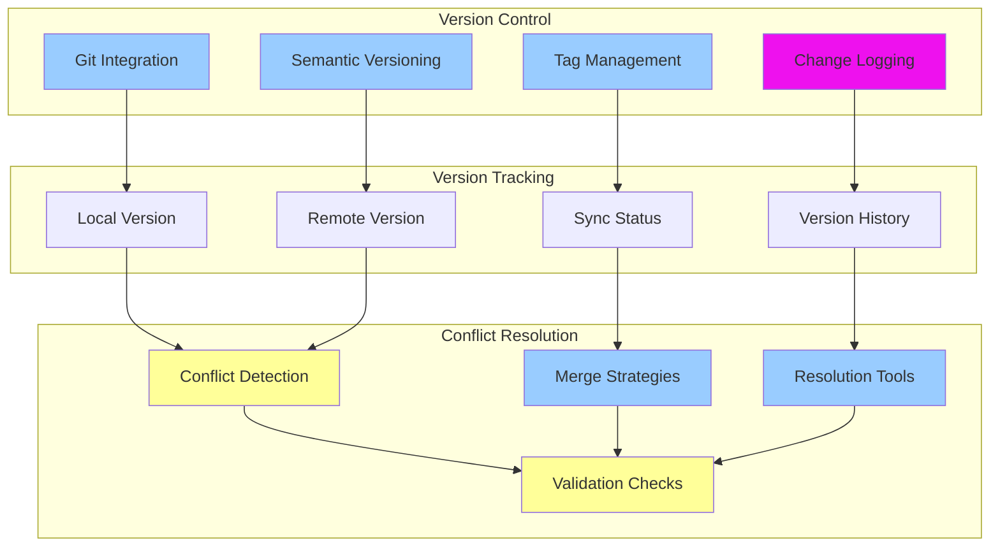

### 2. Branch Management

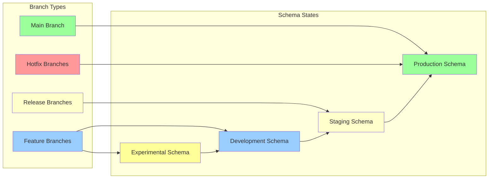

## Schema Documentation System

### 1. Auto-documentation Generation

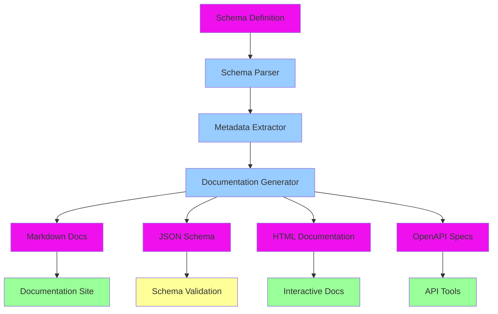

### 2. Documentation Features

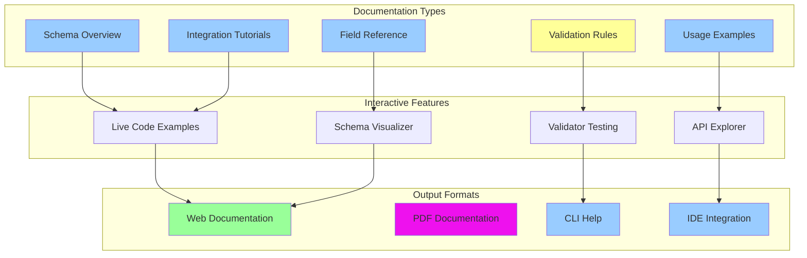

## Performance Optimization

### 1. Schema Processing Optimization

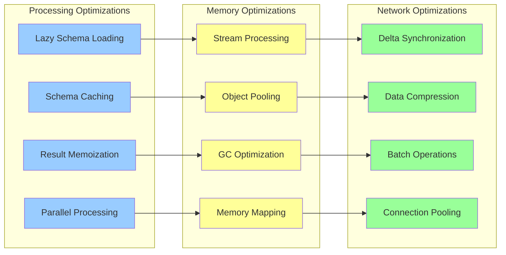

### 2. Validation Performance

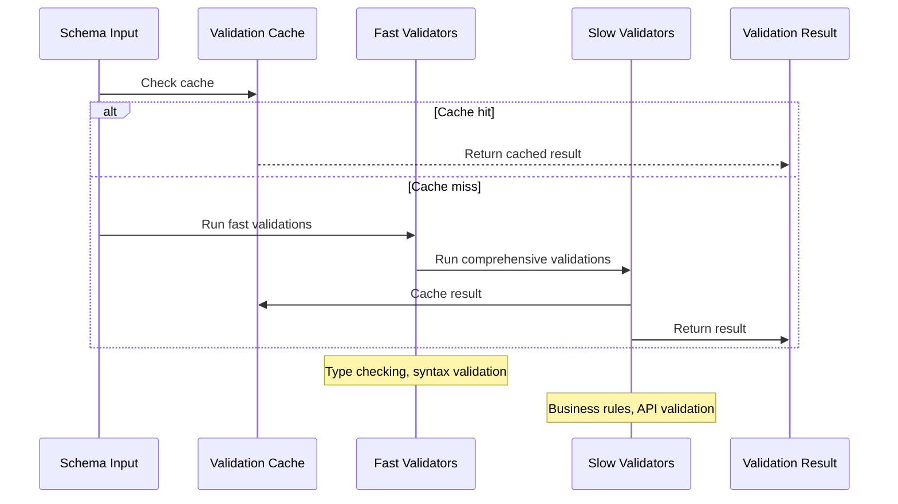

## Testing Strategy

### 1. Schema Testing Framework

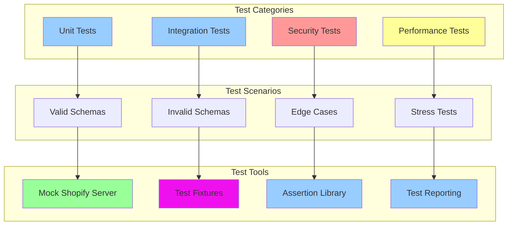

### 2. Continuous Integration

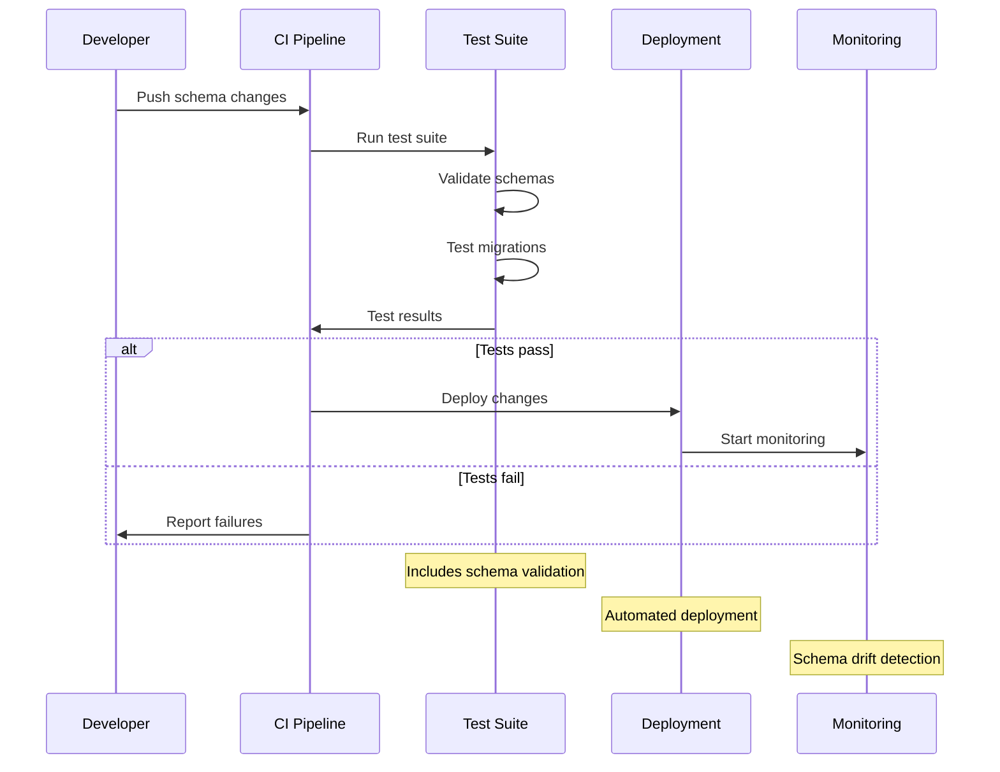